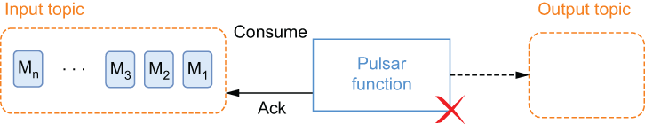
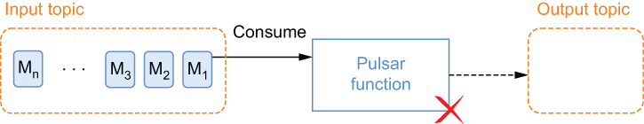
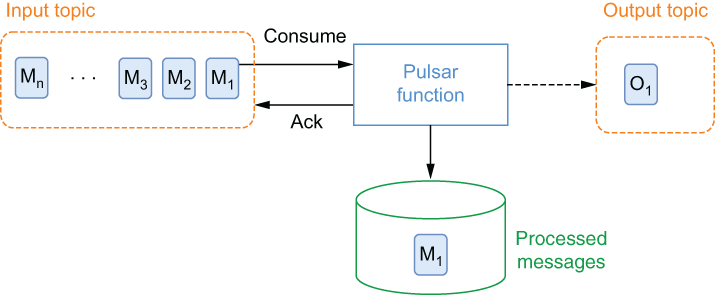

### 4.5.2 Function configuration

Now that we know how to generate a deployment artifact, the next step is to configure and deploy our Pulsar functions. All functions are required to provide some basic configuration details when they are deployed to Pulsar, such as the input and output topics and other details. There are two ways this configuration information can be specified. The first is as command-line arguments passed to the pulsar-admin functions CLI tool using the create (https://pulsar.apache.org/docs/en/functions-cli/ \#create) and update (https://pulsar.apache.org/docs/en/functions-cli/#update) function commands (e.g., bin/pulsar-admin functions create), and the second is via a single configuration file.

Which method you choose is a matter of preference, but I would strongly encourage the use of the latter, as it not only simplifies the deployment process, but also allows you to store the configuration details in source control along with the source code. This allows you to refer to the properties at any time and ensures that you are always running your functions with the correct configuration. If you choose this approach, you will only need to provide two configuration values when you deploy your functions: the name of the function artifact file containing the executable function code and the name of the file containing all the configuration settings. The contents of a configuration file named function-config.yaml are shown in the following listing. We are going to use this file to deploy the KeywordFilterFunction to the Pulsar cluster running inside the Docker container we started earlier in the chapter.

Listing 4.22 The function configuration file for the KeywordFilterFunction

className: com.manning.pulsar.chapter4.functions.sdk.KeywordFilterFunction\
tenant: public                                                  ❶\
namespace: default                                              ❷\
name: keyword-filter\
inputs:                                                         ❸\
- persistent://public/default/raw-feed\
output: persistent://public/default/filtered-feed\
userConfig:                                                     ❹\
  keyword : Director\
  ignore-case: false\
 \
\##################################\
\# Processing \
\##################################\
autoAck: true                                                   ❺\
logTopic: persistent://public/default/keyword-filter-log\
processingGuarantees: ATLEAST_ONCE                              ❻\
retainOrdering: false                                           ❼\
timeoutMs: 30000\
subName: keyword-filter-sub                                     ❽\
cleanupSubscription: true

❶ Every function must have an associated tenant.

❷ Every function must have an associated namespace.

❸ There can be more than one input topic per function.

❹ The user configuration key, value map

❺ Whether or not the function should acknowledge the message after it has processed the message

❻ The delivery semantics applied to the function

❼ Whether or not the function should process the input messages in the order they were published

❽ The name of the subscription on the input topic

As you see, this file provides all the properties needed to run the Pulsar function, including the class name, input/output directories, and much more. It also contains the following configuration settings that control how the messages are consumed by the function:

- auto_ack—Whether messages consumed from the input topic(s) are automatically acknowledged by the function framework or not. When set to the default value of true, each message that doesn’t result in an exception is acked automatically when the function is done executing. If set to false, the function code is responsible for message acknowledgment.

- retain-ordering—Whether messages are consumed in exactly the order they appear on the input topics or not. When set to true, negatively acknowledged messages will be redelivered before any unprocessed messages.

- processing-guarantees—The processing guarantees (delivery semantics) applied to messages consumed by the function. Possible values are \[ATLEAST\_ ONCE, ATMOST_ONCE, EFFECTIVELY_ONCE\].

When executing a stream processing application, you may want to specify the delivery semantics for the data processing within your Pulsar functions. These guarantees are meaningful, since you must always assume there is the possibility of failures in the network or machines that can result in data loss.

In the context of Pulsar Functions, these processing guarantees determine how often a message is processed and how it is handled in the event of failure. Pulsar Functions supports three distinct messaging semantics that you can apply to any function. By default, Pulsar Functions provides at-most-once delivery guarantees, but you can configure your Pulsar function to provide any of the following message processing semantics instead.

At-most-once delivery guarantees

At-most-once processing does not provide any guarantee that data is processed, and no additional attempts will be made to reprocess the data if it was lost before the Pulsar function could process it. Each message that is sent to the function will either be processed one time at the most or not at all.

As you can see in figure 4.6, when a Pulsar function is configured to use at-most-once processing, the message is immediately acknowledged after it is consumed, regardless of whether the message is successfully processed or not. In this scenario, message M2 will be processed next by the function even if message M1 caused a processing exception.

Figure 4.6 With at-most-once processing, the incoming messages are acknowledged, regardless of processing success or failure. This gives each message just one chance at being processed.

You only want to use this processing guarantee if your application can handle periodic data loss without impacting the correctness of the data. One such example would be a function that calculates the average value of a sensor reading, such as a temperature. Over the lifetime of the function, it will process tens of millions of individual temperature readings, and the loss of a handful of these readings will be inconsequential to the accuracy of the computed average.

At-least-once delivery guarantees

At-least-once processing guarantees that any data published to one of the function’s input topics will be successfully processed by the function at least one time. In the event of a processing failure, the message will automatically be redelivered. Therefore, there is the possibility that any given message could be processed more than once.

With this processing semantic, the Pulsar function reads the message from the input topic, executes its logic, and acknowledges the message. If the function fails to acknowledge the message, it is reprocessed. This process is repeated until the function acknowledges the message. Figure 4.7 depicts the scenario in which the function consumes the message but encounters a processing error that causes it to fail to send an acknowledgment. In this scenario, the next message processed by the function would be M1, and would continue to be M1 until the function succeeds.

Figure 4.7 With at-least-once processing, if the function encounters an error and fails to acknowledge the message, then the same message will be processed again.

You will only want to use this processing guarantee if your application can handle processing the same data multiple times without impacting the correctness of the data. One such scenario would be if the incoming messages represented records that would be updated in a database. In such a scenario, multiple updates with the same values would have no impact on the underlying database.

Effectively-once delivery guarantees

With effectively-once guarantees, a message can be received and processed more than once, which is common in the presence of failures. The crucial thing is that the actual outcome of the function processing on the resulting state will be as if the reprocessed events were observed only once. This is most often what you will want to achieve.

Figure 4.8 With effectively-once processing, duplicate messages will be ignored.

Figure 4.8 depicts the scenario in which an upstream producer to the function’s input topic has re-sent the same message, M1. When configured to provide effectively-once processing, the function will check to see if it has previously processed the message (based on user-defined properties), and if so, it will ignore the message and send an acknowledgment so that it will not be reprocessed.
