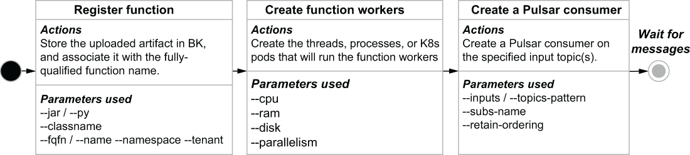

### 4.5.4 The function deployment life cycle

As we saw in the previous section, there are quite a few configuration parameters available when creating and updating a function. In this section, we will cover how some of those parameters are used within the Pulsar function deployment life cycle. When a function is first created, the associated library bundle is stored in Apache BookKeeper so it can be accessed by any Pulsar broker node in the cluster. The bundle is associated with the fully qualified function name, which is a combination of the tenant, namespace, and function name to ensure that it is globally unique across the Pulsar cluster.

Figure 4.9 The Pulsar function deployment life cycle

When a Pulsar function is first created, the steps shown in figure 4.9 are performed in sequence. After the function is registered and all its details are persisted to BookKeeper, function workers are created based on the provided configuration parameters and the Pulsar cluster’s deployment mode (which we will discuss in the next section). The function workers are the runtime instantiations of the Pulsar function code and can be threads, processes, or Kubernetes pods. Lastly, within each function worker, a Pulsar consumer and subscription is created on the configured input topics. The function workers then await the arrival of incoming messages and perform their processing logic on the incoming messages.
