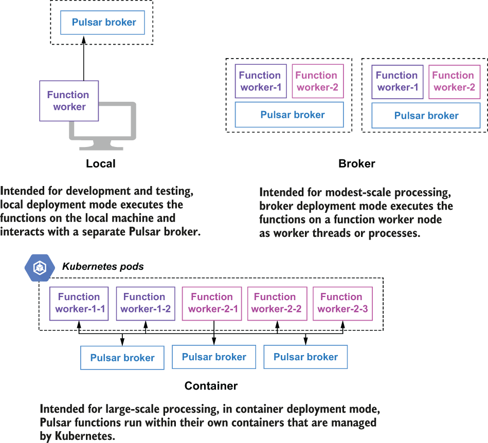

### 4.5.5 Deployment modes

As we have seen, to deploy and manage Pulsar Functions, you need to have a Pulsar cluster running; however, there are a couple of options for where your Pulsar function instances will run. You can have the Pulsar function run on your local development machine (*localrun mode*) in which case it interacts with the broker over the network. This was what we did with the LocalRunner test case. For production, you will want to deploy your functions in *cluster mode*.

Cluster mode

In this mode, users submit their functions to a running Pulsar cluster, and Pulsar will take care of distributing them across the function workers for execution. The Pulsar Functions framework supports the following runtime options when running in cluster mode: thread, process, and Kubernetes, as shown in figure 4.10, and these refer to how the function code itself is executed inside a *function worker*, which is the runtime environment used to host Pulsar Functions.

Figure 4.10 A Pulsar function can run as a thread, process, or Kubernetes StatefulSet inside the Pulsar functions workers.

In Pulsar, there are two options for where the function workers can run. One option is to run inside the Pulsar brokers themselves, which simplifies the deployment. The other option is to start the function worker processes on their own separate nodes to provide better resource isolation between them and your brokers.

The benefits of running the function workers on the broker node itself, as either a thread or a separate process, include that it has a smaller hardware footprint, as you won’t need as many nodes in your environment, and a reduction in network latency between the function processes and the broker that is serving the messages. However, running the function workers on separate nodes provides better resource isolation and insulates the pulsar broker process from being inadvertently killed by a function worker crashing and bringing the broker down with it.
