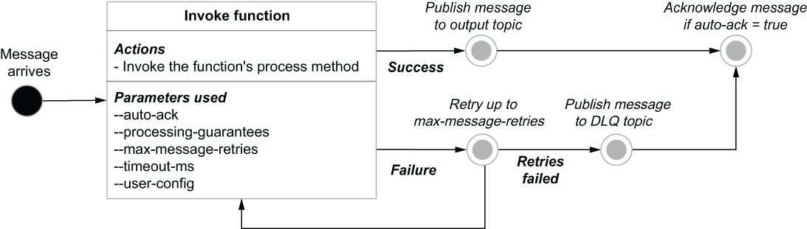

### 4.5.6 Pulsar function data flow

Before I conclude this chapter, I want to take a moment to document the flow of an individual message through a Pulsar function and tie the various stages back to the configuration parameters supplied when you first create or update a function, so you have a better understanding of how to configure your functions. The data flow inside a Pulsar function is depicted in the state machine shown in figure 4.11, along with the configuration properties that control the function behavior.

Figure 4.11 The basic message flow for a Pulsar function running inside of a Pulsar worker

When a message arrives on any of the function’s configured input topics, the function’s process method is called with the message contents as an input parameter. If the function can successfully process the message without encountering any runtime exceptions, the value returned by the method call is published to the configured output topic, unless it is a void function, in which case nothing is published.

However, if the function encounters a runtime exception, the message is retried up to the value configured in the max-message-retries parameter. If all these attempts fail, the message is routed to the configured dead-letter-queue topic (if any), so it can be retained for future examination. In either case, the message is acknowledged as consumed by the Pulsar function if the auto-ack flag was configured to true, allowing the next message to be processed.
