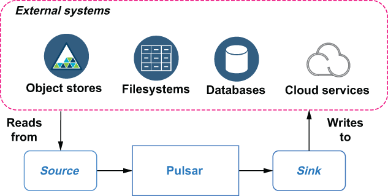

## 5.1 What are Pulsar IO connectors?

The Pulsar IO connector framework provides developers, data engineers, and operators an easy way to move data into and out of the Pulsar messaging platform without having to write any code or become experts in both Pulsar and the external system. From an implementation perspective, Pulsar IO connectors are just specialized Pulsar functions purpose-built to interface with external systems through an extensible API interface.

Compare this to a scenario in which you had to implement the logic for interacting with an external system, such as MongoDB, inside a Java class that uses the Pulsar Java client. Not only would you have to become familiar with the client interface for MongoDB and Pulsar, but you would also have the operational burden of deploying and monitoring a separate process that is now a critical part of your application stack. Pulsar IO seeks to make the movement of data into and out of Pulsar less cumbersome.

Figure 5.1 Sources consume data from external systems, while sinks write data to external systems.

Pulsar IO connectors come in two types: *sources*, which ingest data from an external system into Pulsar, and *sinks*, which feed data from Pulsar into an external system. Figure 5.1 illustrates the relationship between sources, sinks, and Pulsar.

## 子目录

- [5.1.1 Sink connectors](<5.1-what-are-pulsar-io-connectors_/5.1.1-sink-connectors.md>)
- [5.1.2 Source connectors](<5.1-what-are-pulsar-io-connectors_/5.1.2-source-connectors.md>)
- [5.1.3 PushSource connectors](<5.1-what-are-pulsar-io-connectors_/5.1.3-pushsource-connectors.md>)
