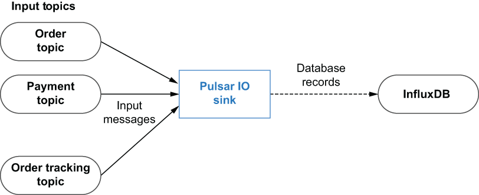

### 5.1.1 Sink connectors

While the Pulsar IO framework already provides a collection of built-in connectors for some of the most popular data systems, it was designed with extensibility in mind, allowing users to add new connectors as new systems and APIs are developed. The programming model behind Pulsar IO Connectors is very straightforward, which greatly simplifies the development process. Pulsar IO sink connectors can receive messages from one or more *input* topics. Every time a message is published to any of the input topics, the Pulsar sink’s write method is called.

The implementation of the write method is responsible for determining how to process the incoming message contents and properties in order to write data to the source system. The Pulsar sink shown in figure 5.2 can use the message contents to determine which database table to insert the record into and then construct and execute the appropriate SQL command to do so.

Figure 5.2 Overview of the Pulsar IO sink connector programming model

The easiest way to create a custom sink connector is to write a Java class that implements the org.apache.pulsar.io.core.Sink interface shown in listing 5.1. The first method defined in the interface is the open method, which is called just once when the sink connector is created and can be used to initialize all the necessary resources (e.g., for a database connector, you can create the JDBC client). The open method also provides a single input parameter, named config, from which you can retrieve all the connector-specific settings (e.g., the database connection URL, username, and password). In addition to the passed-in config object, the Pulsar runtime also provides a SinkContext for the connector that provides access to runtime resources, much like the Context object does in the Pulsar Functions API.

Listing 5.1 The Pulsar sink interface

package org.apache.pulsar.io.core;\
 \
public interface Sink\<T\> extends AutoCloseable {\
    /\*\*\
     \* Open connector with configuration\
     \*\
     \* @param config initialization config\
     \* @param sinkContext\
     \* @throws Exception IO type exceptions when opening a connector\
     \*/\
    void open(final Map\<String, Object\> config, \
              SinkContext sinkContext) throws Exception;\
 \
    /\*\*\
     \* Write a message to Sink\
     \* @param record record to write to sink\
     \* @throws Exception\
     \*/\
    void write(Record\<T\> record) throws Exception;\
}

The other method defined in the interface is the write method, which is responsible for consuming messages from the sink’s configured source Pulsar topic and writing the data to the external source system. The write method receives an object that implements the org.apache.pulsar.functions.api.Record interface, which provides information that can be used when processing the incoming message. It is worth pointing out that the sink interface extends the AutoCloseable interface, which includes a close method definition that can be used to release any resources, such as database connections or open file writers, before the connector is stopped.

Listing 5.2 The record interface

package org.apache.pulsar.functions.api\
 \
public interface Record\<T\> {\
 \
    default Optional\<String\> getTopicName() {           ❶\
        return Optional.empty();\
    }\
 \
    default Optional\<String\> getKey() {                 ❷\
        return Optional.empty();\
    }\
 \
    T getValue();                                       ❸\
 \
    default Optional\<Long\> getEventTime() {             ❹\
        return Optional.empty();\
    }\
 \
    default Optional\<String\> getPartitionId() {         ❺\
        return Optional.empty();\
    }\
 \
    default Optional\<Long\> getRecordSequence() {        ❻\
        return Optional.empty();\
    }\
 \
    default Map\<String, String\> getProperties() {       ❼\
        return Collections.emptyMap();\
    }\
 \
    default void ack() {                                ❽\
    }\
 \
    default void fail() {                               ❾\
    }\
 \
    default Optional\<String\> getDestinationTopic() {    ❿\
        return Optional.empty();\
    }\
}

❶ If the record originated from a topic, report the topic name.

❷ Return a key if the key has one associated.

❸ Retrieves the actual data of the record

❹ Retrieves the event time of the record from the source

❺ If the record is originated from a partitioned source, return its partition ID. The partition ID will be used as part of the unique identifier by the Pulsar IO runtime to do message deduplication and achieve an exactly-once processing guarantee.

❻ If the record is originated from a sequential source, return its record sequence. The record sequence will be used as part of the unique identi-fier by Pulsar IO runtime to do message deduplication and achieve an exactly-once processing guarantee.

❼ Retrieves user-defined properties attached to the record

❽ Acknowledge that the record has been processed.

❾ Indicate to the source system that this record has failed to be processed.

❿ To support message routing on a per message basis

The implementation of the record should also provide two methods: ack and fail. These two methods will be used by the Pulsar IO connector to acknowledge the records that have been processed and fail the records that have failed. Failure to acknowledge or fail messages within the source connector will result in the messages being retained, which will ultimately cause the connector to stop processing due to backpressure.
