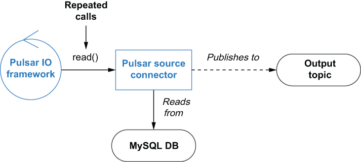

### 5.1.2 Source connectors

Pulsar IO source connectors are responsible for consuming data from external systems and publishing the data to the configured output topic. There are two distinct types of sources supported by the Pulsar IO framework; the first are those that operate on a pull-based model. As you can see in figure 5.3, the Pulsar IO framework repeatedly calls the Source connector’s read() method to pull data from the external source into Pulsar.

Figure 5.3 The Source connector’s read() method is repeatedly called, which then pulls the information from the database and publishes it to Pulsar.

In this particular case, the logic inside the connector’s read() method would be responsible for querying the database, converting the result set into Pulsar messages, and publishing them to the output topic. This type of connector would be particularly useful when you have a legacy order entry application that only writes incoming orders into a MySQL database, and you want to expose these new orders to other systems for real-time processing and analysis.

The easiest way to create a pull-based source connector is to write a Java class that implements the org.apache.pulsar.io.core.Source interface, which is shown in listing 5.3. The first method defined in this interface is the open method, which is called just once when the source connector is created and should be used to initialize all the necessary resources, such as a database client.

The open method specifies an input parameter, named config of type Map, from which you can retrieve all the connector-specific settings, such as the database connection URL, username, and password. This input parameter contains all of the values specified in the file specified by the —source-config-file parameter along with all the default configuration settings and values provided by the various switches used to create or update a function.

Listing 5.3 The Pulsar source interface

package org.apache.pulsar.io.core;\
 \
public interface Source\<T\> extends AutoCloseable {\
   /\*\*\
    \* Open source with configuration\
    \*\
    \* @param config initialization config\
    \* @param sourceContext\
    \* @throws Exception IO type exceptions when opening a connector\
    \*/\
    void open(final Map\<String, Object\> config,\
           SourceContext sourceContext) throws Exception;\
 \
    /\*\*\
     \* Reads the next message from source.\
     \* If source does not have any new messages, this call should block.\
     \* @return next message from source. The result should never be null\
     \* @throws Exception\
    \*/\
    Record\<T\> read() throws Exception;\
 \
}

In addition to the config parameter, the Pulsar runtime also provides a SourceContext for the connector. Much like the context object defined in the Pulsar Function API, the SourceContext object provides access to runtime resources for tasks like collecting metrics, retrieving stateful property values, and more.

The other method defined in the interface is the read method, which is responsible for retrieving data from the external source system and publishing it to the target Pulsar topic. The implementation of this method should be blocking on this method if there is no data to return and should never return null. The read() method returns an object that implements the org.apache.pulsar.functions.api.Record interface that we saw earlier in listing 5.2. It is worth pointing out that the source interface also extends the AutoCloseable interface that includes a close method definition, which should be used to release any resources, such as database connections, before the connector is stopped
