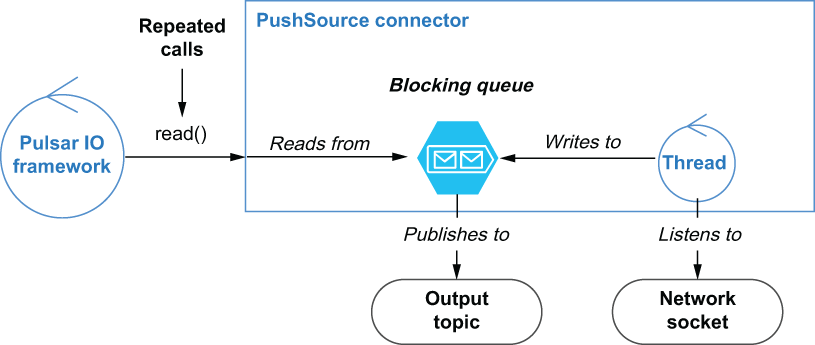

### 5.1.3 PushSource connectors

The second type of source connectors are those that operate on a push-based model. These connectors continuously gather data and buffer it inside an internal blocking queue for eventual delivery to Pulsar. As you can see from figure 5.4, PushSource connectors typically have a background thread running continuously that gathers information from the source system and buffers it inside an internal queue. When the Pulsar IO framework repeatedly calls the Source connector’s read() method, the data inside that internal queue is then published into Pulsar.

Figure 5.4 The PushSource connector’s has a background thread running that is listening to a network socket and pushing all the traffic it receives to a blocking queue. When the read() method is called, the data is pulled from the blocking queue.

In this particular case, the connector has a background thread that is listening to all incoming traffic on a network socket and publishing it to the internal queue. This type of connector is particularly useful when you are consuming data from an external source that does not retain any information and can be periodically queried at any future point in time. A network socket is just such an example in that if the thread wasn’t connected and listening at all times, data sent over that network connection would be lost forever. Contrast this with the previous connector which queries a database. In that scenario, the connector can query the database after an order has been entered into the database and still retrieve the data because the database has retained it.

The easiest way to create a push-based source connector is to write a Java class that extends the abstract org.apache.pulsar.io.core.PushSource class shown in the following listing. Since this class implements the Source interface, your class must provide an implementation of all the methods we discussed in the previous section.

Listing 5.4 The PushSource class

package org.apache.pulsar.io.core;\
/\*\*\
 \* Pulsar's Push Source interface. PushSource read data from\
 \* external sources (database changes, twitter firehose, etc)\
 \* and publish to a Pulsar topic. The reason its called Push is\
 \* because PushSources get passed a consumer that they\
 \* invoke whenever they have data to be published to Pulsar.\
 \*/\
public abstract class PushSource\<T\> implements Source\<T\> {\
 \
  private LinkedBlockingQueue\<Record\<T\>\> queue;\
  private static final int DEFAULT_QUEUE_LENGTH = 1000;\
 \
  public PushSource() {\
   this.queue = new LinkedBlockingQueue\<\>(this.getQueueLength());    ❶\
  }\
 \
  @Override\
  public Record\<T\> read() throws Exception {\
   return queue.take();                                              ❷\
  }\
 \
  /\*\*\
\* Attach a consumer function to this Source. This is invoked by the \
\* implementation to pass messages whenever there is data to be \
\* pushed to Pulsar.\
\*\
\* @param record next message from source which should be sent to \
\*  a Pulsar topic\
\*/\
  public void consume(Record\<T\> record) {\
    try {\
   queue.put(record);                                                ❸\
   } catch (InterruptedException e) {\
     throw new RuntimeException(e);\
   }\
  }\
 \
  /\*\*\
\* Get length of the queue that records are push onto\
\* Users can override this method to customize the queue length\
\* @return queue length\
\*/\
  public int getQueueLength() {\
   return DEFAULT_QUEUE_LENGTH;                                      ❹\
  }\
}

❶ The BatchPushSource uses an internal blocking queue to buffer messages.

❷ Messages are read from the internal queue that blocks if no data is available.

❸ Incoming messages are stored in the internal queue that blocks if it is full.

❹ You must override this method if you want to increase the size of the internal queue.

The key architectural feature of the PushSource is the LinkedBlockingQueue that is used to buffer messages before they are published to Pulsar. This queue allows you to have a continuously running process that listens for incoming data and publishes it to Pulsar. It is also worth noting that the internal queue can be constrained to the desired size, which allows you to limit the memory consumption of the PushSource connector. When the blocking queue reaches the configured size limit, no more records can be published to the queue. This will result in the background thread getting blocked, which could lead to data loss when the queue is full. Therefore, it is important to size the queue properly.
