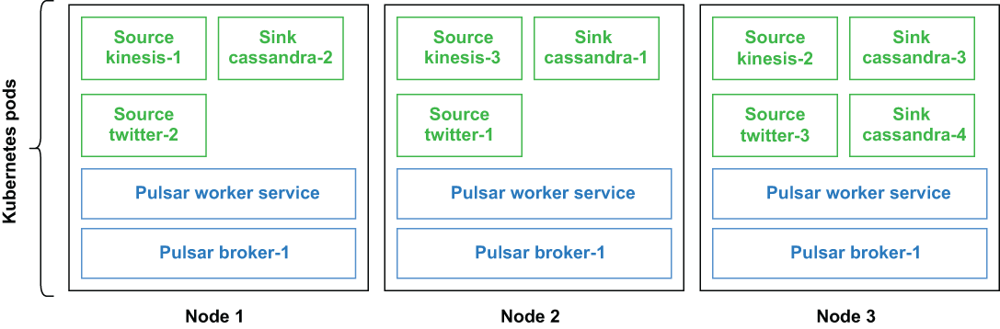

## 5.4 Deploying Pulsar IO connectors

As specialized Pulsar functions, IO connectors utilize the same runtime environment that provides all the benefits of the Pulsar Functions framework, including fault tolerance, parallelism, elasticity, load balancing, on-demand updates, and much more. With respect to deployment options, you can have the Pulsar IO connector run on your local development machine, in *localrun mode*, inside the function workers in the Pulsar cluster, or in *cluster mode*. In the previous section, we were using the LocalRunner to run our connector in localrun mode. In this section, I will walk you through the process of running the DirectorySource connector we developed in cluster mode.

Figure 5.5 Pulsar IO connector deployment on Kubernetes

Figure 5.5 shows a cluster-mode deployment inside a Kubernetes environment, where each connector runs in its own container alongside other non-connector function instances. In cluster mode, Pulsar IO connectors leverage the fault-tolerance capability offered by the Pulsar Functions runtime scheduler to handle failures. If a connector is running on a machine that fails, Pulsar will automatically attempt to restart the task on one of the remaining running nodes in the cluster.

## 子目录

- [5.4.1 Creating and deleting connectors](<5.4-deploying-pulsar-io-connectors/5.4.1-creating-and-deleting-connectors.md>)
- [5.4.2 Debugging deployed connectors](<5.4-deploying-pulsar-io-connectors/5.4.2-debugging-deployed-connectors.md>)
