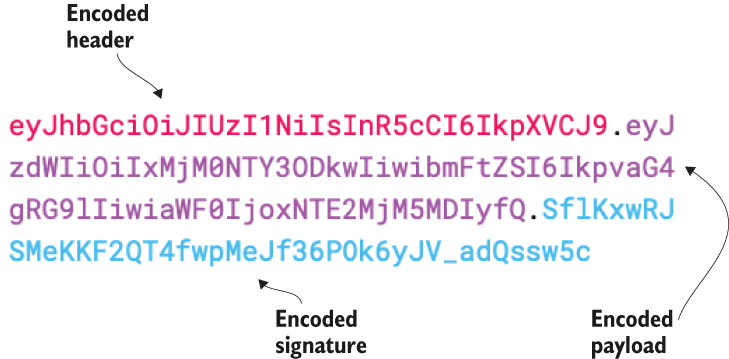
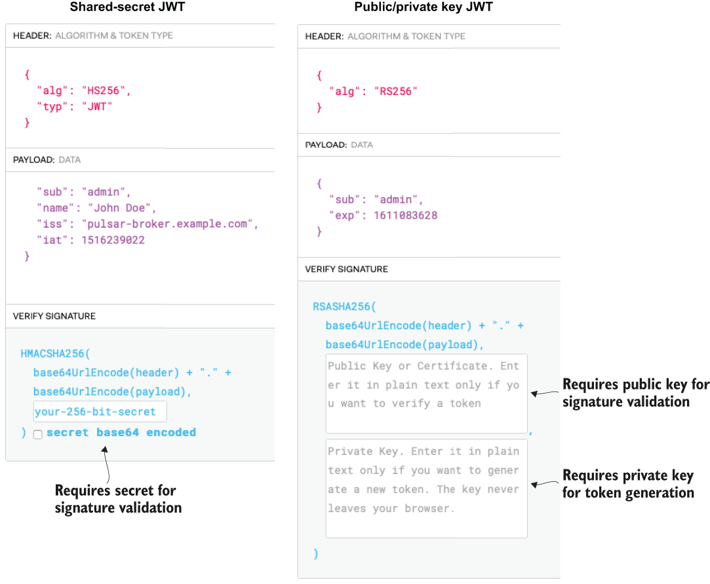

### 6.2.2 JSON Web Token authentication

Pulsar supports authenticating clients using security tokens that are based on JWT, which is a standardized format used to create JSON-based access tokens that assert one or more claims. Claims are factual statements or assertions. The two claims that can be found in all JWT are iss (issuer), which identifies the party that issued the JWT, and sub, which identifies the subject or party the JWT carries information about.

In Pulsar, JWTs are used to authenticate a Pulsar client and associate it with some role, which will then be used to determine what actions it is authorized to perform, such as publish or consume from a given topic. Typically, the administrator of the Pulsar cluster would generate a JWT that has a sub claim associated with a specific role (e.g., admin that identifies the owner of the token). The admin would then provide the JWT to a client over a secure communication channel, and the client could then use that token to authenticate with Pulsar and be assigned to the admin role.

The JWT standard defines the structure of a JWT as consisting of the following three parts: the header, which contains basic information; the payload, which contains the claims; and the signature, which can be used to validate the token. Data from each of these parts is encoded separately and concatenated together, using periods to delineate the fields. The resulting strings look something like figure 6.1, which can be transmitted easily over HTTP.

Since JWTs are based on an open standard, the contents of a JWT are readable to anyone in possession of it. This means that anyone can attempt to gain access to your system with a JWT they generate themselves or by altering an intercepted JWT and modifying one or more of the claims to impersonate a validated user. This is where the signature comes into play, as it provides a means to establish the authenticity of the entire JWT.

Figure 6.1 An encoded JSON web token and its corresponding parts

The signature is calculated by encoding the header and payload, using Base64 URL encoding and concatenating the two together along with a secret. That string is then passed through the cryptographic hashing algorithm specified in the header. With JWTs, there are two cryptographic schemes you can use; the first is referred to as a shared secret scheme in which both the party that generates the signature and the party that verifies it must know the secret. Since both parties are in possession of the secret, each party can verify the authenticity of a JWT by calculating the signature for themselves and validate that the value they computed matches the value in the JWT’s signature section. Any discrepancy indicates that the token has been tampered with. This scheme is useful when you want or need both parties to be able to exchange information back and forth in a secure manner. The second scheme uses an asymmetric public/private key pair in which the party with the public key can validate the authenticity of any JWT it receives, and the party with the private key can generate valid JWTs.

There are several online tools available that allow you to encode and decode JWTs, and figure 6.2 shows the side-by-side output from one such tool that was used to decode two different JWTs. The output on the left is from a token that is using the shared secret scheme. As you can see, the contents of the token can be easily read by the tool without any additional credentials. However, the secret key is required in order to validate the token’s signature to confirm it hasn’t been tampered with.

Figure 6.2 Verification methods for shared secret vs. public/private key pair signed JWTs

The output on the right side of the figure is from a JWT using the asymmetric scheme, whose contents can also be easily read without any additional credentials. However, the public key is required to verify the token’s signature. The tool also requires a private key only if you wish to use it to generate a new JWT. Hopefully, this helps clarify the differences between the two and why both the JWT token and an associated key are required to configure Pulsar brokers and clients to use JWT for authentication.

Lastly, it is worth mentioning that anyone in possession of a valid JWT can use it to authenticate with Pulsar. Therefore, adequate precautions should be taken to prevent an issued JWT from falling into unwanted hands. This includes only sending JWT tokens over a TLS-encrypted connection and storing the contents of a JWT in a safe location on the client machine. To enable JWT authentication, we append a command to the Dockerfile from the previous section, which executes another script named gen-tokens.sh that generates JWTs that can be used for authentication, as shown in the following listing.

Listing 6.15 Updated Dockerfile contents

FROM apachepulsar/pulsar-standalone:latest    \
ENV PULSAR_HOME=/pulsar\
 \
...                                                                 ❶\
 \
RUN \["/bin/bash", "-c", \
     "/pulsar/manning/security/authentication/jwt/gen-tokens.sh"\]   ❷

❶ Same content as shown in figure 6.9

❷ Execute the specified script to generate some JWT tokens for role-based authentication.

Let’s take a look at the gen-token.sh script in the following listing to see exactly what steps are required to generate the JWTs that can be used to authenticate with the Pulsar broker.

Listing 6.16 Contents of the gen-token.sh file

\#!/bin/bash\
 \
\# Create a public/private keypair. \
/pulsar/bin/pulsar tokens create-key-pair \\                       ❶\
   --output-private-key \\\
      /pulsar/manning/security/authentication/jwt/my-private.key \\\
   --output-public-key \\\
      /pulsar/manning/security/authentication/jwt/my-public.key\
   \
\# Create the token for the admin role\
/pulsar/bin/pulsar tokens create --expiry-time 1y \\\
     --private-key \\                                              ❷\
       file:///pulsar/manning/security/authentication/jwt/my-private.key \\\
     --subject admin \> /pulsar/manning/security/authentication/jwt/admin-\
        ➥ token.txt\
 \
...                                                                  ❸

❶ We are going to use asymmetric encryption, so we need to create a key pair.

❷ Create a token and give it the subject of admin.

❸ Repeats token creation process for additional roles

After this script is executed, there will be several JWT tokens that have been generated and stored as text files on the Pulsar broker. These tokens, along with the public key, will need to be distributed to the Pulsar clients so they can be used to authenticate to the pulsar-standalone instance. The properties shown in the following listing have also been modified inside the standalone.conf file to enable JWT-based authentication.

Listing 6.17 JWT authentication property changes to the standalone.conf file

\#### JWT Authentication #####\
authenticationEnabled=true                              ❶\
authorizationEnabled=true                               ❷\
authenticationProviders=org.apache.pulsar.broker.authentication.\
➥ AuthenticationProviderTls,org.apache.pulsar.broker.authentication.\
➥ AuthenticationProviderToken                          ❸\
tokenPublicKey=file:///pulsar/manning/security/\
➥ authentication/jwt/my-public.key                     ❹

❶ This is required for any authentication mechanism in Pulsar.

❷ Enable authorization.

❸ Append the JWT token provider to the list of authentication providers.

❹ The location of the public key of the JWT key pair which is used for signature validation

If you want to use JWT authentication, you will need to make the changes shown in the following listing to the client.conf file. Since we have previously enabled TLS authentication for the client, we will need to comment out those properties for now, since the client can only use one authentication method at a time.

Listing 6.18 JWT authentication property changes to the client.conf file

\#### JWT Authentication #####\
authPlugin=org.apache.pulsar.client.impl.auth.AuthenticationToken\
authParams=file:///pulsar/manning/security/authentication/jwt/admin-token.txt\
 \
\#### TLS Authentication ####\
\#authPlugin=org.apache.pulsar.client.impl.auth.AuthenticationTls         ❶\
\#authParams=tlsCertFile:/pulsar/manning/security/authentication/tls/admin.cert\
➥ .pem,tlsKeyFile:/pulsar/manning/security/authentication/tls/admin-pk8.pem

❶ Comment out both of the TLS authentication properties.

Now, let’s rebuild the image to include the changes necessary to generate the JWTs and enable JWT-based authentication by executing the commands shown in the following listing. Be sure to have stopped and removed any previous running instances of the Pulsar image before doing so.

Listing 6.19 Building the Docker image from the Dockerfile

\$ cd \$REPO_HOME/pulsar-in-action/docker-images/pulsar-standalone    ❶\
\$ docker build . -t pia/pulsar-standalone-secure:latest             ❷\
Sending build context to Docker daemon  3.345MB\
Step 1/9 : FROM apachepulsar/pulsar-standalone:latest               ❸\
 ---\> 3ed9bffff717\
....\
Step 8/9 : RUN \["/bin/bash", "-c", "/pulsar/manning/security/authentication/jwt/\
➥ gen-tokens.sh"\]                                                  ❹\
Step 9/9 : CMD \["/pulsar/bin/pulsar", "standalone"\]\
 ---\> Using cache\
 ---\> a229c8eed874\
Successfully built a229c8eed874\
Successfully tagged pia/pulsar-standalone-secure:latest             ❺

❶ Change to the directory that contains the Dockerfile.

❷ Command to build the Docker image from the Dockerfile and tag it

❸ Notice that there are now nine steps instead of eight.

❹ Executes the gen-token.sh script

❺ Success message, including the tag used to reference the image

Next, we need to follow the steps shown in listing 6.7 again to launch a new container based on the updated Docker image, ssh into the container, and run the publish-credentials.sh script inside the newly launched bash session to make these JWTs available to us in the \${HOME}/exchange folder on our local machine. Next, we will attempt to use JWT authentication by using the Java program shown in the following listing, which is available in the GitHub repo associated with this book.

Listing 6.20 Authenticating with JWT

import org.apache.pulsar.client.api.\*;\
 \
public class JwtAuthClient {\
public static void main(String\[\] args) throws PulsarClientException {\
    final String HOME = "/Users/david/exchange";\
    final String TOPIC = "persistent://public/default/test-topic";\
        \
    PulsarClient client = PulsarClient.builder()\
       .serviceUrl("pulsar+ssl://localhost:6651/")\
       .tlsTrustCertsFilePath(HOME + "/ca.cert.pem")\
       .authentication(\
           AuthenticationFactory.token(() -\> {\
        try {\
          return new String(Files.readAllBytes(\
            Paths.get(HOME+"/admin-token.txt")));\
        } catch (IOException e) {\
          return "";\
        }\
        })).build();\
 \
    Producer\<byte\[\]\> producer = \
      client.newProducer().topic(TOPIC).create();\
        \
    for (int idx = 0; idx \< 100; idx++) {\
      producer.send("Hello JWT Auth".getBytes());\
    }        \
     System.exit(0);\
}\
}

That concludes the configuration of authentication on the Pulsar broker. From this point forward, all Pulsar clients will be required to present valid credentials to be authenticated. Thus far, we have only implemented two of the four authentication mechanisms supported by Pulsar, TLS, and JWT. Additional authentication methods can be enabled by following the steps outlined in Pulsar’s online documentation.
