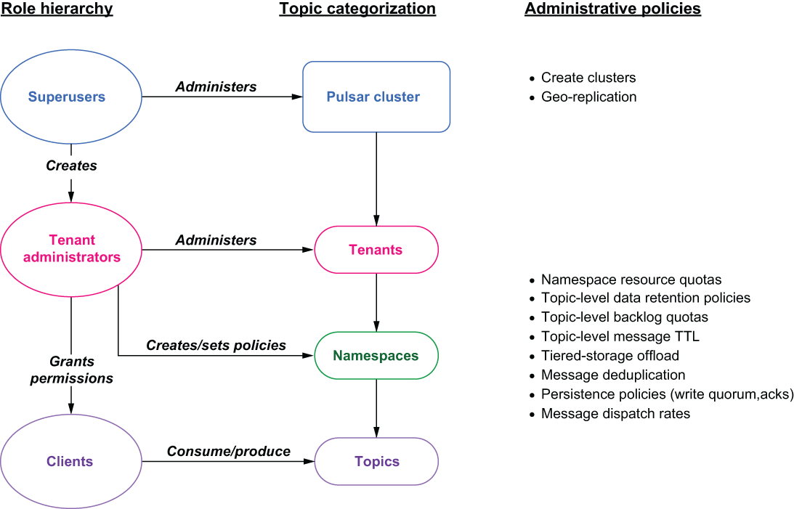

### 6.3.1 Roles

In Pulsar, roles are used to define a collection of privileges, such as permission to access a particular set of topics that are assigned to groups of users. Apache Pulsar uses the configured authentication providers to establish the identity of a client and then assign a *role token* to that client. These role tokens are then used by the authorization mechanism to determine what actions the clients are allowed to make.

Figure 6.3 The Pulsar role hierarchy and its corresponding administrative tasks

Role tokens are analogous to physical keys that are used to open a lock. Many people may have a copy of the key, and the lock doesn’t care who you are, only that you have the right key. Within Pulsar, the hierarchy of roles falls into three categories, each with their own capabilities and intended uses. As you can see from figure 6.3, the role hierarchy closely mirrors Pulsar’s cluster/tenant/namespace hierarchy when it comes to structuring data. Let us examine each of these roles in greater detail.

Superusers

Just as the name implies, superusers can perform any action at any level of the Pulsar cluster; however, it is considered a best practice to delegate the administration of a tenant and its underlying namespaces to another person who will be responsible for the administration of that particular tenant’s policies. Therefore, superusers’ primary activity is the creation of tenant admins, which can be accomplished from the pulsar-admin CLI by executing a command similar to the one shown in the following listing.

Listing 6.21 Creating a Pulsar tenant

\$PULSAR_HOME/bin/pulsar-admin tenants create tenant-name \\    ❶\
   --admin-roles tenant-admin-role \\                          ❷\
   --allowed-clusters standalone                               ❸

❶ Specifies the tenant’s name

❷ Specifies the tenant admin role name for the tenant

❸ Specifies the clusters where the tenant will exist

This allows the superuser to focus on cluster-wide administrative tasks, such as cluster creation, broker management, and configuring tenant-level resource quotas to ensure all the tenants receive their fair share of the cluster’s resources. Typically, the administration of a tenant is given to a user that is responsible for designing the layout of the topics required for the tenant, such as a department head, project manager, or application team leader.

Tenant administrators

The primary focus of the tenant administrator is the design and implementation of namespaces within their tenant. As I discussed earlier, namespaces are nothing more than a logical collection of topics that have the same policy requirements. Namespace-level policies apply to each topic within a given namespace and allow you to configure things such as *data retention policies*, *backlog quotas*, and *tiered-storage* *offload*.

Clients

Last are the client roles, which can be any application or service that has been granted permission to consume from or produce to topics with the Pulsar cluster. These permissions are granted by the tenant admins at either the namespace level, meaning they apply to all the topics in a particular namespace, or on a per-topic basis. Listing 6.22 shows an example of both scenarios.
