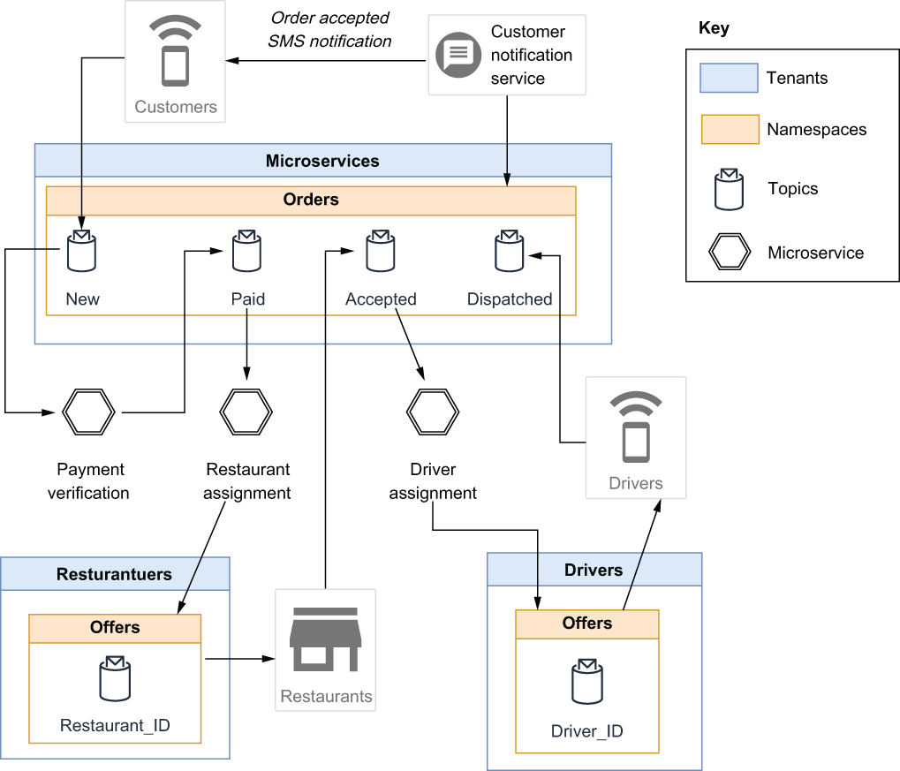
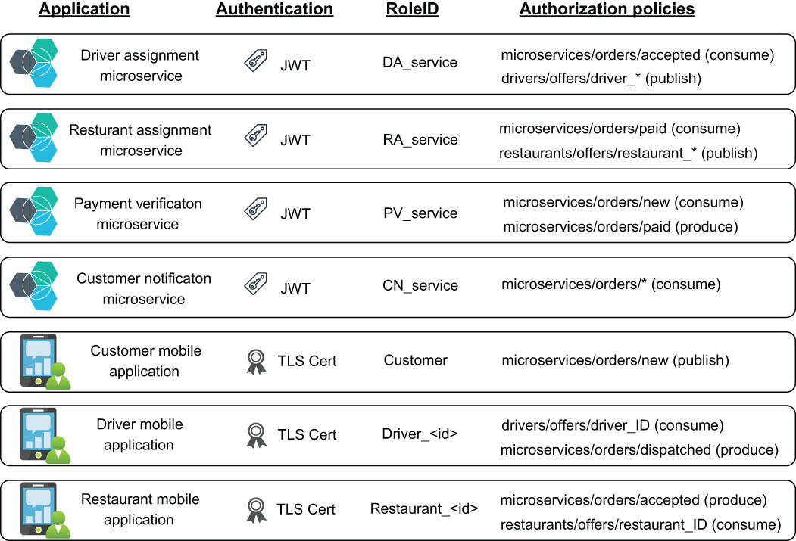

### 6.3.2 An example scenario

Let’s imagine you are working for a food delivery company named GottaEat that allows customers to order food from a variety of participating restaurants and have it delivered directly to you. Rather than employ their own fleet of drivers, your company has decided to enlist private individuals to deliver the food to keep costs down. The company will use three separate mobile applications to conduct business: a publicly available one for customers, a restricted one for all participating restaurateurs, and a restricted one for all authorized delivery drivers.

Order placement use case

Next, let’s walk through a very basic use case for your company, the placement of an order by a customer, all the way through to when it is assigned to a driver for delivery using a microservices-based application that uses Apache Pulsar for communicating via messages. We will focus on how you might structure your namespaces under the restaurateurs and driver tenants, along with what permissions you would want to grant. The microservices tenant will be used by multiple tenants, so it is created and managed by the application team. Figure 6.4 shows the overall message flow in the order entry use case.

Figure 6.4 Message flow during the order placement use case

In this use case, a customer uses the company’s mobile application to select some food items, enter the desired delivery address, provide their payment information, and submit the request. The order information is published to the persistent:// microservices/orders/new topic by the mobile application.

The payment verification microservice consumes the inbound order and communicates with the credit card payment system to secure payment for the items before placing the order in the persistent://microservices/orders/paid topic to indicate that payment has been captured for the items. The service also replaces the raw credit card information with an internal tracking ID that be used at a later time to access the payment.

The restaurant assignment microservice is responsible for finding a restaurant that can fulfill the order by consuming from the persistent://microservices/ orders/paid topic and determining a subset of candidate restaurants based on the food items and delivery location. It then sends out an offer to each of these restaurants by publishing the order details to a specific restaurant’s topic that only they can access (e.g., persistent://restaurateurs/offers/restaurant_4827) to ensure the order is only fulfilled by one restaurant. If the offer is rejected, or after a certain amount of time elapses, the offer is rescinded and sent to the next restaurant in the list until it is fulfilled. Once a restaurant accepts the order via their mobile application, a message contain-ing the restaurant details, including location, is published to the persistent://microservices/orders/accepted topic.

Once the order has been accepted, the driver assignment microservice will consume the message from the accepted topic and will attempt to locate a driver who can deliver the order to the customer. It selects a list of potential drivers based on their location, planned routes, etc., and publishes a message to a topic that only the driver can access (e.g., persistent://drivers/offers/driver_5063) to ensure the order is only dispatched to a single driver. If the offer is rejected, or after a certain amount of time elapses, the offer is rescinded and sent to the next driver in the list until it is accepted. If a driver accepts the delivery, a message containing the driver details is published to the persistent://microservices/orders/dispatched topic to indicate that the order is scheduled for delivery.

All of the messages stored inside the topics of the persistent://microservices/ orders namespace contain both a customer_id and order_id data element. A customer notification service is subscribed to all of the topics shown, and when it receives a new record in any of these topics, it parses out those fields and uses the information to send out a notification to the corresponding customer’s mobile app, so they can track the progress of their order.

Tenant creation

As the Pulsar superuser your first task would be to create all three of the tenants and their associated tenant admin roles. So, let’s review the steps required to create the necessary tenants for this use case, as shown in the following listing.

Listing 6.22 Creating the Pulsar tenants

\$PULSAR_HOME/bin/pulsar-admin tenants create microservices \\\
  --admin-roles microservices-admin-role\
 \
\$PULSAR_HOME/bin/pulsar-admin tenants create drivers \\\
  --admin-roles drivers-admin-role\
 \
\$PULSAR_HOME/bin/pulsar-admin tenants create restaurateurs \\\
  --admin-roles restaurateurs -admin-role

Since we are delegating the administration of these tenants to someone else within our organization, I will take a moment to outline the characteristics of the individuals who should serve in this capacity on a tenant-by-tenant basis:

- Since the microservices tenant is used to share information across multiple services and applications, a good candidate for the corresponding tenant admin should be an IT professional responsible for architectural decisions across departments, such as an enterprise architect.

- For the restaurateurs’ tenant, a good candidate would be the person(s) in charge of the acquisition of new restaurateurs, as they will be the ones responsible for soliciting, vetting, and managing these partners. They can include the creation of restaurateurs’ private topics as part of the onboarding process, etc.

- Similarly, a good candidate for administering the driver’s topic would be the person(s) in charge of the acquisition of new drivers.

Authorization policies

Based on the requirements for this use case, we would devise an overall security design similar to the one shown in figure 6.5, which defines the following security requirements:

- The application that requires access

- The authentication method it will use

- The topics and namespaces it will access, and how

- The roleID we will assign to these permissions

Figure 6.5 Application-level security requirements for the order placement use case

For example, we know that the driver assignment microservice will use a JWT to authenticate with Pulsar and be assigned the DA_service role token, which will grant consume permission on the persistent://microservices/orders/accepted topic and produce permission on all the topics in the persistent://drivers/offers namespace. Therefore, the commands shown in listing 6.23 would need to be executed to enable the security policies for the DA_service role, and similar commands would be required for the other services as well. It is worth mentioning that, even though there may be multiple instances of the driver assignment service running, they can all use the same RoleID. This is *not* the case for some of the mobile applications, since we will need to know exactly which user is accessing the system to enforce our security policies.

Listing 6.23 Enabling security for the driver assignment microservice

\$PULSAR_HOME/bin/pulsar-admin namespaces create microservice/orders      ❶\
 \
\$PULSAR_HOME/bin/pulsar tokens create \\                                 ❷\
   --private-key file:///path/to/private-secret.key \\\
   --subject DA_service \> DA_service-token.txt                           ❸\
 \
\$PULSAR_HOME/bin/pulsar-admin namespaces grant-permission \\\
   drivers/offers --actions produce --role DA_service                    ❹\
 \
\$PULSAR_HOME/bin/pulsar-admin topics grant-permission \\\
   persistent://microservices/orders/accepted \\\
   --actions produce \\\
   --role DA_service                                                     ❺

❶ Create the microservices/order namespace; this only needs to be done once.

❷ Create a JWT for the DA_service role.

❸ Save the token in a text file to share with the service deployment team.

❹ Grant the DA_service role permission to publish to any topic in the drivers/offers namespace.

❺ Grant the DA_service role permission to consume from a single topic.

The JWT should be saved to a file and shared with the team that will be deploying the driver assignment service, so they can make it available to the service at runtime by either bundling it with the service or placing it in a secure location, such as a Kubernetes secret. The mobile applications, in contrast, will use custom client certificates that are generated after the driver or restaurateur has been successfully onboarded and issued a unique ID, as the client certificate that is generated will be associated with that specific ID in order to uniquely identify to the user when they connect (e.g., driver_4950 would be issued a client certificate associated with a common name of driver_4950 and would be granted a role token for that role). We can see this in the following listing, which shows the steps that would be taken by the driver-admin-role to add a new driver to the Pulsar cluster.

Listing 6.24 Onboarding a new driver

openssl req -config file:///path/to/openssl.cnf \\\
      -key file:///path/to/driver-4950.key.pem -new -sha256 \\           ❶\
      -out file:///path/to/driver-4950.csr.pem \\\
      -subj "/C=US/ST=CA/L=Palo Alto/O=gottaeat.com/CN=driver_4950" \\   ❷\
      -passin pass:\${CLIENT_PASSWORD}\
 \
openssl ca -config file:///path/to/openssl.cnf \\\
      -extensions usr_cert \\\
      -days 100 -notext -md sha256 -batch \\\
      -in file:///path/to/driver-4950.csr.pem \\                         ❸\
      -out file:///path/to/driver-4950.cert.pem \\                       ❹\
      -passin pass:\${CA_PASSWORD}\
 \
\$PULSAR_HOME/bin/pulsar-admin topics grant-permission \\\
   persistent://drivers/offers/driver_4950 \\                            ❺\
   --actions consume \\\
   --role driver_4950                                                    ❻\
 \
\$PULSAR_HOME/bin/pulsar-admin topics grant-permission \\\
   persistent://microservices/orders/dispatched \\\
   --actions produce \\\
   --role driver_4950    

❶ Use the driver-provided private key to generate a certificate request.

❷ Use the CN field to specify the new roleID for this driver.

❸ Use the CSR to generate a TLS client certificate for the new driver.

❹ The name of the client certificate file, which will be bundled with the mobile app download

❺ Grant the driver_4950 role permission to consume from a dedicated topic.

❻ Grant the driver role permission to produce to the general dispatched topic.

In listing 6.24, we see that a TLS client certificate is generated specifically for the new driver, based on their ID. This certificate is then bundled together with the driver mobile application code to ensure it is always used to authenticate with Pulsar when connecting to the cluster. The driver will then be sent a link they can use to download and install it on their smartphone.
