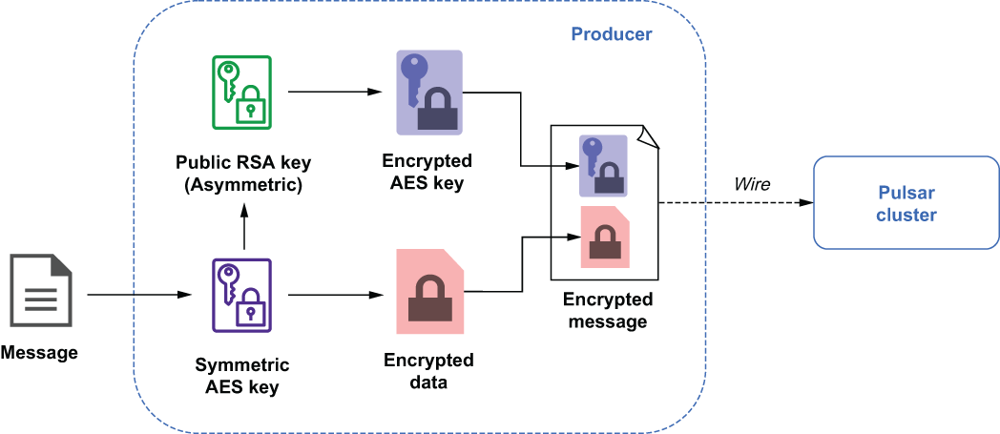
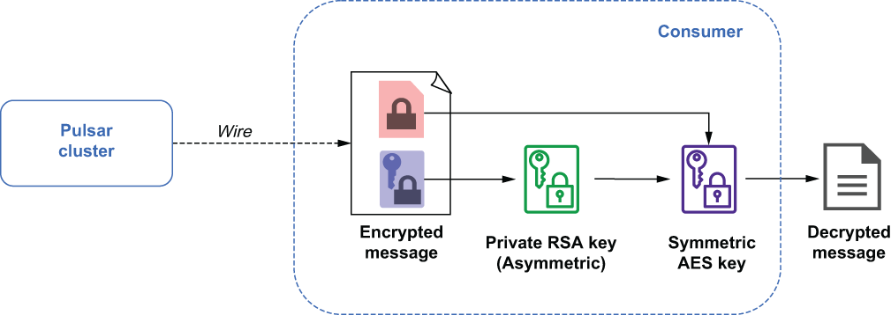

## 6.4 Message encryption

The new orders topic will contain sensitive credit card information that must not be accessible to any consumer other than the payment verification service. Even though we have configured TLS wire encryption to secure the information during transit into the Pulsar cluster, we also need to ensure that the data is stored in an encrypted format. Fortunately, Pulsar provides methods that allow you to encrypt messages’ contents on the producer side before sending them to the broker. These message contents will remain encrypted until a consumer with the correct private key consumes them.

In order to send and receive encrypted messages, you will first need to create an asymmetric key pair. A script named gen-rsa-key.sh is included in the Docker image we have been using, which can be used to generate a public/private key pair. The following listing shows the contents of the script, which is located in the /pulsar/manning/ security/message-encryption folder.

Listing 6.25 Contents of gen-rsa-keys.sh

\# Generate the private key\
openssl ecparam -name secp521r1 \\\
   -genkey \\\
   -param_enc explicit \\\
   -out /pulsar/manning/security/encryption/ecdsa_privkey.pem\
   \
\# Generate the public key\
openssl ec -pubout \\\
   -outform pem \\\
   -in /pulsar/manning/security/encryption/ecdsa_privkey.pem \\\
   -out /pulsar/manning/security/encryption/ecdsa_pubkey.pem

You should give the public key to the producer application, which, in this particular case, is the client mobile application. The private key should only be shared with the payment verification service, since it will need to consume the encrypted messages that are published to the persistent://microservices/orders/new topic. The following listing shows sample code of how to use the public key with a message producer to encrypt the data before it is sent.

Listing 6.26 Encrypted producer configuration

String pubKeyFile = “path to ecdsa_pubkey.pem”;            ❶\
CryptoKeyReader cryptoReader \
    = new RawFileKeyReader(pubKeyFile, null);              ❷\
 \
Producer\<String\> producer = client\
  .newProducer(Schema.STRING)\
  .cryptoKeyReader(cryptoReader)                           ❸\
  .cryptoFailureAction(ProducerCryptoFailureAction.FAIL)   ❹\
  .addEncryptionKey(“new-order-key”)                       ❺\
  .topic(“persistent://microservices/orders/new”)\
  .create();

❶ The client must have access to the public key.

❷ Initialize the crypto reader to use the public key.

❸ Configure the producer to use the public key to encrypt the messages via the CryptoReader.

❹ Tells the producer to throw an exception if the message cannot be encrypted

❺ Provides a name for the encryption key

The following listing shows sample code of how to configure the consumer inside the payment verification service to use the private key to decrypt the messages it consumes from the persistent://microservices/orders/new topic.

Listing 6.27 Configuring a Pulsar client to read from an encrypted topic

String privKeyFile = “path to ecdsa_privkey.pem”;                 ❶\
CryptoKeyReader cryptoReader \
    = new RawFileKeyReader(null, privKeyFile);                    ❷\
 \
ConsumerBuilder\<String\> builder = client\
    .newConsumer(Schema.STRING)\
    .consumerName("payment-verification-service")\
    .cryptoKeyReader(cryptoReader)                                ❸\
    .cryptoFailureAction(ConsumerCryptoFailureAction.DISCARD)     ❹\
    .topic("persistent://microservices/orders/new")\
    .subscriptionName("my-sub");

❶ The client must have access to the public key.

❷ Initialize the crypto reader to use the public key.

❸ Configure the consumer to use the private key to decrypt the messages via the CryptoReader.

❹ Tells the consumer to discard the message if it cannot be decrypted

Now that I’ve covered the steps required to configure the message producers and consumers to support message encryption, I want to drill down into the details of how it is implemented internally within Pulsar and some of the key design decisions you should be aware of to better understand how to leverage it in your applications. Figure 6.6 shows the steps taken on the producer side when message encryption is enabled. When the producers’ send method is called with the raw message bytes, the producer first makes an internal call to the Pulsar client library to get the current symmetric AES encryption key. The encryption key is considered current because these keys are automatically rotated every four hours to limit the impact of someone gaining unauthorized access to the key, limiting the data exposed to a four-hour window in the event of a compromised key, rather than the entire history of the topic.

Figure 6.6 Message encryption on the Pulsar producer

The current AES key is then used to encrypt the raw message bytes of the message, which are then placed in the outbound message’s payload. Next, the *public key* of the RSA asymmetric key pair we generated earlier is used to encrypt the AES key itself, and the resulting encrypted AES key is placed in the outbound message’s header properties.

By encrypting the AES Key with the public key of an asymmetric key pair, we can rest assured that only a consumer with the corresponding private key of the key pair can decrypt (and thus read) the AES key that was used to encrypt the message payload. At this point, all of the data within the outbound message is encrypted: the message payload with the AES key and the message header that contains the AES key, which itself has been encrypted with a public RSA key. The message is then sent over the wire to the Pulsar cluster for delivery to its intended consumers.

Upon receipt of an encrypted message, a consumer performs the steps shown in figure 6.7 to decrypt the message and access the raw data. First, the consumer reads the message headers and looks for the encryption key property, which contains the encrypted AES key. It then uses the private RSA key from the asymmetric key pair to decrypt the contents of the encryption key property to produce the AES key. Now that the consumer is in possession of the AES key, it can decrypt the message contents with it due to the fact that it is a symmetrical key, meaning it is used to both encrypt and decrypt data.

Figure 6.7 Message decryption on the Pulsar consumer

Choosing to store the AES key used to encrypt the message with the encrypted message contents themselves alleviates Pulsar from the responsibility of having to store and manage these encryption keys internally. However, if you lose or delete the RSA private key used to decrypt the RSA key, your message is irretrievably lost and cannot be decrypted by Pulsar. Therefore, it is a best practice to store and manage the RSA key pairs in a third-party key management service, such as AWS KMS.

Now that I have brought up the possibility of a lost RSA key, you might be wondering what exactly happens in such a scenario. Obviously, you never want this to occur, but it can happen, so you need to consider how you want your application to respond and what options you have on both the producer and consumer side.

First, let’s consider the producer side. There are really only two options here. First, you can choose to continue sending the messages without encrypting them. This might be a good option if the value of the data exceeds the risk of having it stored in an unencrypted format for a limited amount of time. For instance, in the order placement scenario we discussed earlier, it would be better to allow the customer orders to be sent rather than to shut down the entire business due to a missing RSA key. Since the data is being sent over a secure TLS connection, the risk is minimal.

The other option is for the producer to fail the messages and throw an exception, which is a good option when risk of the exposing the data outweighs the potential business value of having it delivered in a timely manner. This would typically be some sort of non-customer-facing application, such as a backend payment processing system, that does not have a strict business SLA. You can specify which action you want your producer to take by using the setCryptoFailureAction() method in the producer configuration, as was shown in listing 6.26.

If consumption fails due to decryption failure on the consumer side, then you have three options; first, you can elect to deliver the encrypted contents to the consuming application. However, it will then be the consuming application’s responsibility to decrypt the message. This option is useful when your consumer’s logic is *not* based on the message contents, such as routing of the message to downstream consumers based on the information in the message headers.

The second option is to fail the message, which will make the Pulsar broker redeliver it. This option is useful if you are a shared subscription type, so there are multiple consumers on the same subscription. When you fail the message, you are hoping the decryption issue is isolated to just the current consumer, such as a missing private key on that consumer’s host machine, and if the message is redelivered to another consumer, it will be able to decrypt the message and consume it successfully. Do *not* use this option with an exclusive subscription type, as this will result in the message being redelivered indefinitely to the same consumer, who cannot process it.

The last option is to have the consumer discard the message, which is useful for an exclusive subscription consumer that needs access to the message contents in order to perform its logic. As we discussed earlier, failing the message will result in an infinite number of message redelivers, and the consumer will be stuck reprocessing the message. Such a scenario would halt message consumption on the subscription and steadily increase in the message backlog for the entire topic. Therefore, discarding the message is the only way to prevent this from occurring, but at the cost of message loss.
