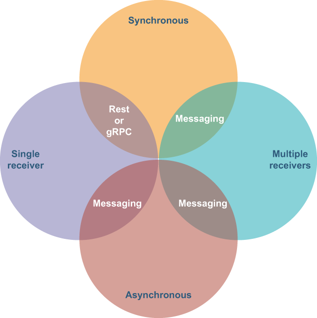

## 7.1 Microservice communication

When you build microservice architectures, one of the concerns you need to address is that of interservice communication. There are different options for interservice communication, each with their own respective strengths and weaknesses. Typically, these various types of communication can be classified across two different decision factors. The first factor is whether the communication between the services is synchronous or asynchronous, and the second factor is whether the communication is intended for a single receiver or multiple receivers, as shown in figure 7.1

Figure 7.1 Microservice communication factors and appropriate communication protocols

Protocols such as HTTP/REST or gRPC are most commonly used as synchronous request/response-based interservice communication mechanisms. With synchronous communication, one service sends a request and waits for a response from another service. The calling service’s execution is blocked and cannot continue its task until it receives a response. This communication pattern is similar to procedure calls in traditional application programming in which a specific method is made to an external service with a specific set of parameters.

With asynchronous communication, one service sends a message and does not need to wait for a response. If you want an asynchronous publish/subscribe-based communication mechanism, messaging systems such as Pulsar are a perfect fit. A messaging system is also required to support publish/subscribe interservice communication between a single service that has multiple message receivers. It is not practical to have a service block until all of the intended recipients have acknowledged the message, as some of them may be offline. A much better approach is to have the messaging system retain the messages.

These factors and communication mechanisms are good to know so you have clarity on the possible communication mechanisms you can use, but they’re not the most important concerns when building microservices. What is most important is being able to integrate your microservices, while maintaining the independence of microservices, and doing so requires the establishment of a contract between the collaborating services, regardless of the communication mechanism you chose.

## 子目录

- [7.1.1 Microservice APIs](<7.1-microservice-communication/7.1.1-microservice-apis.md>)
- [7.1.2 The need for a schema registry](<7.1-microservice-communication/7.1.2-the-need-for-a-schema-registry.md>)
