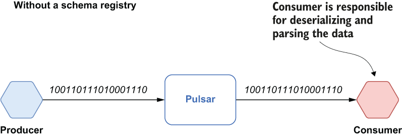

### 7.1.1 Microservice APIs

As with any software development project, clear requirements help development teams create the right software, and having well-defined service contracts up front allows microservice developers to write code without having to make assumptions about the data that will be provided to them or the expected output for any particular method within their service. In this section, I will cover how each of the communication styles supports service contracts.

REST and gRPC protocols

When evaluating the synchronous request/response-based interservice communication mechanisms, one of the biggest differences between REST and gRPC is the format of the payload. The conceptual model used by gRPC is to have services with clear interface definitions and structured messages for requests and responses. This model translates directly to programming language concepts like interfaces, functions, methods, and data structures. It also allows gRPC to automatically generate client libraries for you. These libraries can then be shared between the microservice development teams and act as a formal contract between them.

While the REST paradigm doesn’t mandate any structure, message payloads typically use a loosely-typed data serialization system, such as JSON. Consequently, REST APIs don’t have a formal mechanism for specifying the format of the messages passed between services. The data is passed back and forth as raw bytes, which must be deserialized by the receiving service(s). However, these message payloads have an implied structure that the payload must adhere to. Therefore, any changes to the message payloads must be coordinated between the teams that are developing the services to ensure any changes made by one team do not impact the others. One such example would be the removal of a field that is required by other services. Making such a change would violate the informal contract between the services and cause issues for the consuming services that depend on that particular field to perform their processing logic.

This problem isn’t just limited to the REST protocol either, but rather it is a side effect of the loosely-typed data communication protocol being used. Consequently, this issue also exists with message-based interservice communication that uses a loosely-typed data serialization system.

Messaging protocol

As we saw in figure 7.1, most of the interservice communication patterns can only be supported by a message-based communication protocol. Within Pulsar each message consists of two distinct parts: the message payload, which is stored as raw bytes, and a collection of user defined properties that are stored as key/value pairs. Storing the message payload as raw bytes provides maximum flexibility, but the trade-off is that each message consumer is required to transform these bytes into a format the consuming applications are expecting, as shown in figure 7.2.

Figure 7.2 Pulsar takes raw bytes as input and delivers raw bytes as output.

Different microservices will need to communicate via messages, and in order to do so, both the producer and consumer will need to agree on the basic structure of the messages they are exchanging, including the fields and their associated types. The metadata that defines the structure of these messages is commonly referred to as message schemas. They provide a formal definition of how the raw message bytes should be translated into a more formal type structure (e.g., how the 0s and 1s stored inside the message payload map to a programming-language object type).

Message schemas are the closest we come to a formal contract between the services that generate the messages and the services that consume them. It is useful to think about message schemas as APIs. Applications depend on APIs and expect that any changes made to APIs are still compatible and that applications can still run.
