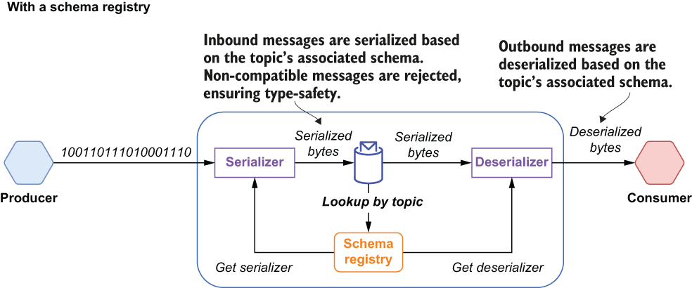
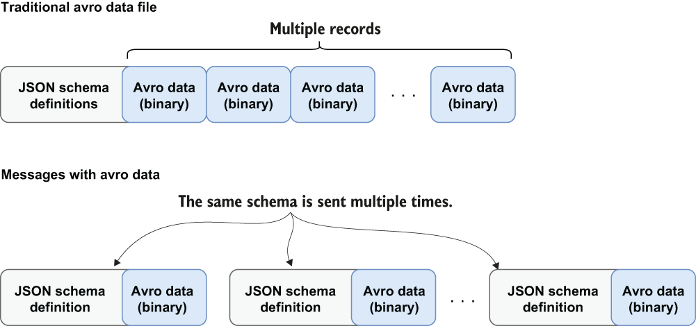

### 7.2.1 Architecture

By default, Pulsar uses the Apache BookKeeper table service for schema storage, since it provides durable, replicated storage that ensures the schema data is not lost. It also provides the added benefit of a convenient key/value API. Since Pulsar schemas are applied and enforced at the topic level, the topic name is used as the key, and the values are represented by a data structure known as SchemaInfo that consists of the fields shown in the following listing.

Listing 7.1 A Pulsar SchemaInfo example

{ \
  “name”: “my-namespace/my-topic”,  ❶\
  “type”: “STRING”,                 ❷\
  “schema”: “”,                     ❸\
  “properties”: {}                  ❹\
}

❶ A unique name, which should match the topic name that the schema is associated with

❷ Will either be one of the predefined schema types, such as STRING or struct, if you are using a generic serialization library, such as Apache Avro or JSON

❸ If you are using a supported serialization type, such as Avro, then this will contain the raw schema data.

❹ A collection of user-defined properties

As you can see in figure 7.3, a Pulsar client relies on the schema registry to get the schema associated with the topic it is connected to and invoke the associated serializer/ deserializer to transform the bytes into the appropriate type. This alleviates the consumer code from the responsibility of having to do the transformation and allows it to focus on the business logic.

Figure 7.3 The Pulsar schema registry is used to serialize the bytes before they are published to a topic and to deserialize them before they are delivered to the consumers.

The schema registry uses the values of the type and schema fields to determine how to serialize and de-serialize the bytes contained inside the message body. The Pulsar schema registry supports a variety of schema types, which can be categorized as either *primitive* types or *complex* types. The type field is used to specify which of these categories the topic schema falls into.

Primitive types

Currently, Pulsar provides several primitive schema types, such as BOOLEAN, BYTES, FLOAT, STRING, and TIMESTAMP, just to name a few. If the type field contains the name of one of these predefined schema types, then the message bytes will be automatically serialized/deserialized into the corresponding programming language-specific type, as shown in table 7.1.

Table 7.1 Pulsar primitive types

|  |  |
|----|----|
| BOOLEAN | A single binary value: 0 = false, 1 = true |
| INT8 | An 8-bit signed integer |
| INT16 | A 16-bit signed integer |
| INT32 | A 32-bit signed integer |
| INT64 | A 64-bit signed integer |
| FLOAT | A 32-bit, single precision floating point number (IEEE 754) |
| DOUBLE | A 64-bit, double precision floating point number (IEEE 754) |
| BYTES | A sequence of 8-bit unsigned bytes |
| STRING | A Unicode character sequence |
| TIMESTAMP | The number of milliseconds since Jan 1, 1970 stored as an INT64 value |

For primitive types, Pulsar does not require or use any data in the schema field because the schema is already implied and, thus, is not necessary.

Complex types

When your messages require a more complex type, you should use one of generic serialization libraries supported by Pulsar, such as Avro, JSON, or protobuf. This would be denoted with an empty string in the type field of the SchemaInfo object associated with the topic, and the schema field will contain a UTF-8 encoded JSON string of the schema definition. Let’s consider how this is applied to an Apache Avro schema definition to better illustrate how the Schema registry simplifies the process.

Apache Avro is a data serialization format that supports the definition of complex data types via language-independent schema definitions in JSON. Avro data is serialized into a compact binary data format that can only be read using the schema that was used when writing it. Since Avro requires that readers have access to the original writer schema in order to deserialize the binary data, the associated schema is typically stored with it at the beginning of the file. Avro was originally intended to be used for storing files with a large number of records of the same type, which allowed you to store the schema once and reuse it as you iterated through the records.

Figure 7.4 Avro messages would require the associated schema to be included with every message to ensure you could parse the binary message contents.

However, in a messaging use case, the schema would have to be sent with every single message, as shown in figure 7.4. Including the schema inside every Pulsar message would be inefficient in terms of memory, network bandwidth, and disk space. This is where Pulsar’s schema registry comes in. When you register a typed producer or consumer that uses an Avro schema, the JSON representation of the Avro schema is stored inside the schema field of the associated SchemaInfo object. The raw bytes of the messages are then serialized or deserialized based upon the Avro schema definition stored inside the Schema registry, as shown in figure 7.3. This eliminates the need to include it with every single message. Furthermore, the corresponding serializer or deserializer is cached inside the producers/consumers, so it can be used on all subsequent messages until a different schema version is encountered.
