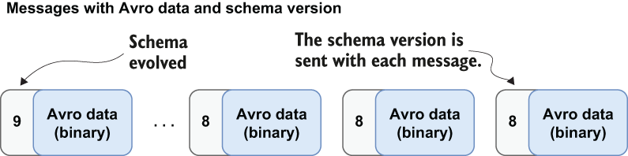

### 7.2.2 Schema versioning

Every SchemaInfo object stored with a topic has a version associated with it. When a producer publishes a message using a given SchemaInfo, the message is tagged with the associated schema version, as shown in figure 7.5. Storing the schema version with the message allows the consumer to use the version to look up the schema in the schema registry and use it to deserialize the message.

Figure 7.5 When using the Schema Registry, Avro messages would contain a schema version rather than the entire schema description. Consumers will use the schema version to retrieve the proper deserializer based on the version.

This is a simple and efficient way to associate the Avro schema with each Avro message without having to attach the schema’s JSON description. The schemas are versioned in increasing order (e.g., v1, v2, ..., etc.), and when the first typed consumer or producer with a schema connects to a topic, that schema is tagged as version 1. Once the initial schema is loaded, the brokers are provided the schema info for the topics they are serving and retain a copy of it locally for schema enforcement.

Within a messaging system such as Pulsar, messages may be retained for an indefinite period of time. Consequently, some consumers will need to process these messages with older versions of the schema. Therefore, the schema registry retains a versioned history of all the schemas used in Pulsar to serve these consumers of historical messages.
