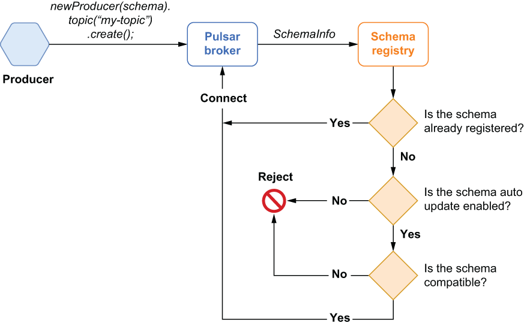
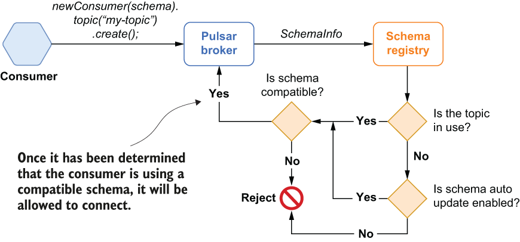

### 7.2.3 Schema compatibility

As you may recall, I started this chapter with a discussion of the importance of maintaining compatibility of messages used by microservices, even as requirements and applications evolve. In Pulsar, every producer and consumer is free to use their own schema, so it is quite possible that a topic could contain messages that conform to different schema versions, as shown in figure 7.5, where the topic contains messages with schema version 8 and messages with schema version 9.

It is important to point out that the schema registry does *not* ensure that every producer and consumer is using the exact same schema but, rather, that the schemas they are using are compatible with one another. Consider the scenario where a development team changes the schema of the messages it is producing by adding or removing a field or changing one of the existing field types from string to timestamp. In order to maintain the implicit producer-consumer contract and avoid accidently breaking consumer microservices, we need to ensure that the producers are publishing messages that contain all the information the consumers require. Otherwise, we run the risk of introducing messages that will break existing applications because you have removed a field that is required by these applications.

When you configure the schema registry to validate schema compatibility, the Pulsar schema registry will perform a compatibility check when the producer connects to the topic. If the change will not break the consumers and cause exceptions, the change is considered compatible, and the producer is allowed to connect to the topic and produce messages with the new schema type. This approach helps prevent disparate development teams from introducing changes that break existing applications that are already consuming from Pulsar topics.

Producer schema compatibility verification

Every time a typed producer connects to a topic, as shown in figure 7.6, it will transmit a copy of the schema it is using to the broker. A SchemaInfo object is created based on the passed-in schema and is passed to the schema registry. If the schema is already associated with the topic, the producer is allowed to connect and can then proceed to publish messages using the specified schema.

Figure 7.6 The logical flow of the schema validation checks for a typed producer

If the schema is not already registered with the topic, the schema registry checks the AutoUpdate strategy setting for the associated namespace to determine whether or not the producer is permitted to register a new schema version on the topic. At this point, the producer will be rejected if the policy prohibits the registration of new schema versions. If schema updates are permitted, then the compatibility strategy check is performed, and if it passes, the schema is registered with the schema registry, and the producer is allowed to connect with the new schema version. If the schema is determined to be incompatible, then the producer is rejected.

Consumer schema compatibility verification

Every time a typed consumer connects to a topic, as shown in figure 7.7, it will transmit a copy of the schema it is using to the broker. A SchemaInfo object is created based on the passed-in schema and is passed to the schema registry.

Figure 7.7 The logical flow of the schema validation checks for a typed consumer

If the topic doesn’t have any active producers or consumers, any registered schemas, or any existing data, then it is considered *not in use*. In the absence of all of the aforementioned items, the schema registry checks the AutoUpdate strategy setting for the associated namespace to determine whether or not the consumer is permitted to register a new schema version on the topic. The consumer will be rejected if it is prohibited from registering its schema; otherwise, the compatibility strategy check is performed, and if it passes, the schema is registered with the schema registry, and the consumer is allowed to connect with the new schema version. If the schema is determined to be incompatible, then the consumer is rejected. The compatibility check is also performed if the topic is *in use*.
