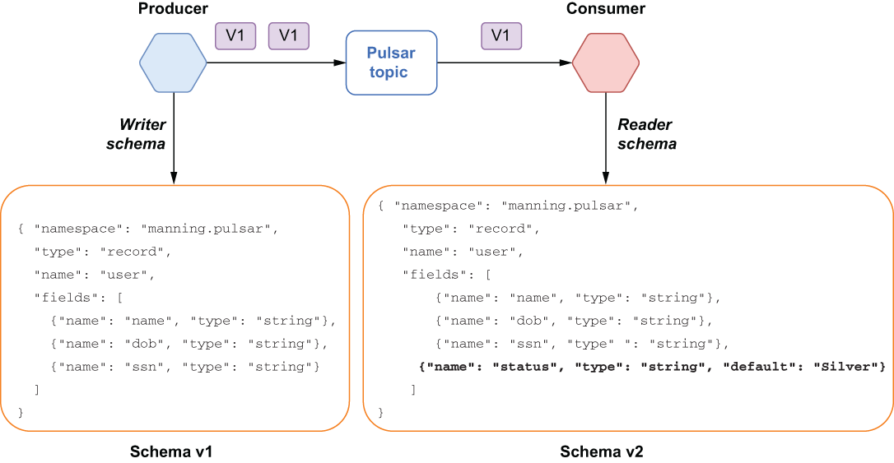
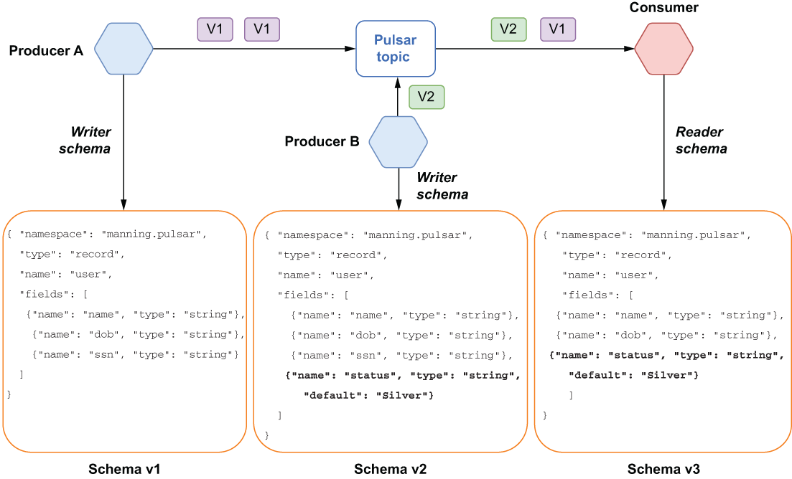
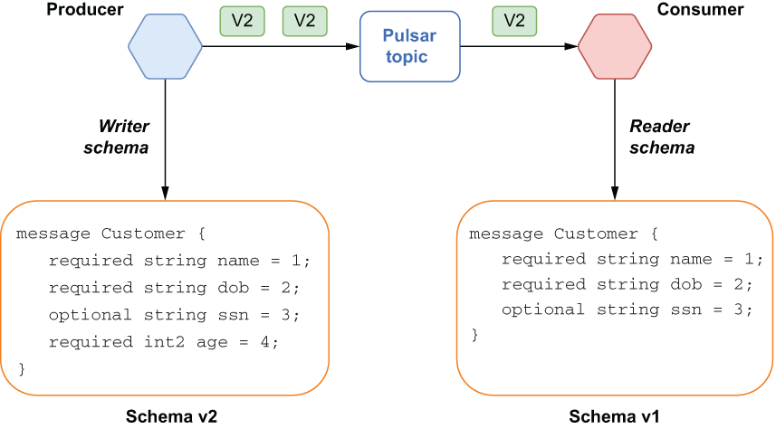
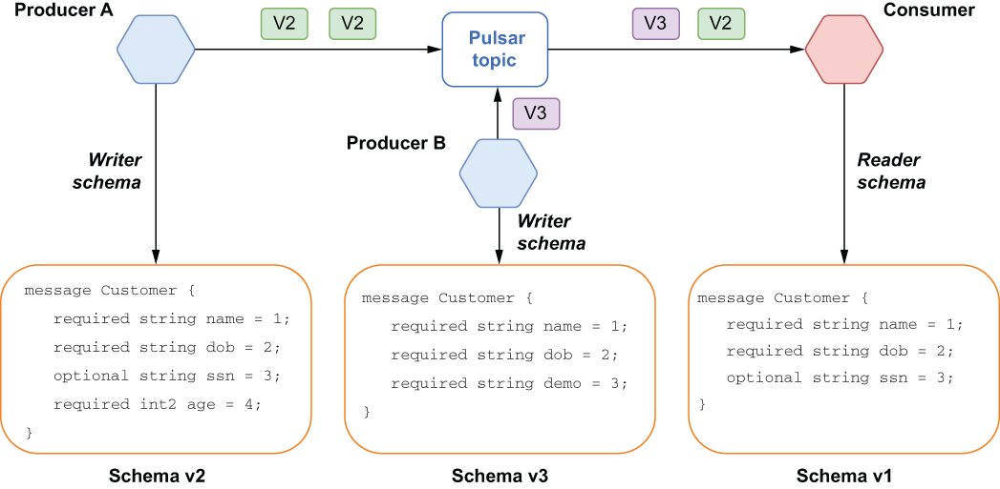

### 7.2.4 Schema compatibility check strategies

The Pulsar schema registry supports six different compatibility strategies, which can be configured on a per-topic basis. It is important to point out that all of the compatibility checks are from the consumer’s perspective, even when it comes to the compatibility checks for producers, as the goal is to prevent the introduction of messages that the existing consumers cannot process. The Schema registry will use the underlying serialization library’s (e.g., Avro’s) compatibility rules to determine whether or not the new schema is compatible with the current schema. The Pulsar schema registry’s default compatibility type is BACKWARD, which is described in greater detail, along with the others, in the following sections.

Backward compatibility

Backward compatibility means that the consumer can use a newer version of the schema and still be able to read messages from a producer that is using the previous version. Consider the scenario where both the producer and consumer start out using the same version of the Avro schema: v1. One of the teams responsible for developing one of the consumers decides to add a new field called status to the schema to support a new customer loyalty program that has various status tiers, such as silver, gold, and platinum, as shown in figure 7.8. In this case, the new schema version, v2, would be considered backward compatible, since it specifies a default value for the newly added field.

Figure 7.8 Backward compatible changes are those that allow a consumer that is using a newer version of the schema to still be able to process messages that are written using the previous version of the schema.

This allows data written with v1 of the schema to be read by the consumer, since the default value specified in the newer schema will be used for the missing field when deserializing the messages serialized with v1, thereby treating all members as having silver status in the consuming application.

To support this type of use case, you can use the BACKWARD schema compatibility strategy. However, that only supports the case where you have consumers that are one schema version ahead of your producers. If you want to support producers that are more than one schema version behind your consumers, you can use the BACKWARD\_ TRANSITIVE compatibility strategy instead.

Let’s expand upon the use case from the previous example. Now we have a new microservice added to the application that is responsible for determining a customer’s loyalty status and is producing messages that contain the status field.

Also, the microservice that originally introduced the need for the status field has undergone a security review, and it has been determined that having the customer’s social security number poses too big of a security risk, so it has been removed. As you can see from figure 7.9, we still have the original producer that is using schema v1, the new microservice that is using v2 of the schema that includes the status field, and a consumer that is using a third schema version that has removed the ssn field.

Figure 7.9 Backward transitive compatible changes are those that allow a consumer that is using a newer version of the schema to still be able to process messages that are written using any of the previous versions of the schema.

In order to be considered backward transitive compatible, the new consumer schema version, v3, would have to be able to process messages from both active producers (e.g., schema versions v1 and v2). Since v3 specifies a default value for the status field, data written with v1 of the schema can be read by the consumer, since the default value specified in v3 of the schema will be used for the missing field when deserializing the messages serialized with v1. Similarly, since the messages serialized with v2 of the schema contain all of the fields required in v3, the consumer can simply ignore the extra ssn field in these messages.

Forward compatibility

Forward compatibility means that the consumer can use an older version of the schema and still be able to read messages from a producer that is using a new version. Consider the scenario where both the producer and consumer start out using the same version of the protobuf schema: v1. One of the teams responsible for developing one of the producers decides to add a new field called age to the schema to support a new marketing program based on different age groups, as shown in figure 7.10.

Figure 7.10 Forward compatible changes are those that allow a consumer that is using an older version of the schema to still be able to process messages that are written using a newer version of the schema.

In this case, the new schema version, v2, would be considered forward compatible, since it simply added a new field that wasn’t in the previous version. This allows data written with v2 of the schema to be read by the consumer, since the newly added field will be ignored when deserializing the messages serialized with v2. The consumer can continue processing the messages, since it does not have any dependency on the newly added age field.

To support this type of use case, you can use the FORWARD schema compatibility strategy. However, that only supports the case where you have consumers that are one schema version behind the message producers. If you want to support producers that are more than one schema version ahead of your consumers, then you can use the FORWARD_TRANSITIVE compatibility strategy instead.

Let’s expand upon the use case from the previous example. Now we have a new microservice added to the application that is responsible for determining a customer’s demographic based on the age field, and that returns a message containing a brand-new field, demo, and eliminates the optional ssn field, as shown in figure 7.11.

Figure 7.11 Forward transitive compatible changes are those that allow a consumer using an older version of the schema to still be able to process messages that are written using any of the newer versions of the schema.

In order to be considered forward transitive compatible, the consumer schema version, v1, would have to be able to process messages from both active producers (e.g., schema versions v2 and v3). Since v1 specifies that the ssn field is optional, data written with v3 of the schema can be read by the consumer, because this field is not required, and the consumer must be prepared to handle null values for this field. Also, since the messages serialized with v2 and v3 both contain additional fields that are not specified in v1, the consumer can simply ignore these extra fields in the messages, as they are not required by the consumer.

Full compatibility

Full compatibility means the schema is both backward and forward compatible. Data serialized using an older version of the schema can be deserialized with the new schema, and data serialized using a newer version of the schema can also be deserialized with the previous version of the schema.

In some data formats, such as JSON, there are no full-compatible changes. Every modification is either only forward or backward compatible. But in other data formats, like Avro or protobuf, where you can define fields with default values, adding or removing a field with a default value is considered a fully compatible change. To support this type of use case, you can use either the FULL or FULL_TRANSITIVE schema compatibility strategies.
