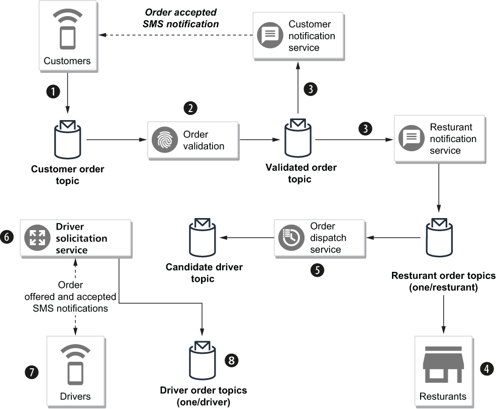

## 7.3 Using the schema registry

Let’s consider a scenario from the GottaEat food delivery company that allows customers to find and order food from any participating restaurant in the company’s network and have it delivered to any location they choose. Orders can be placed via the company website or mobile application. Delivery of the food order is handled via a network of independent drivers who are required to download a specialized mobile application onto their smartphones. The drivers will receive notifications of food orders that are available for delivery within their area and have the option of accepting or declining the orders.

Once an order has been accepted by the driver, it is added to their itinerary for the evening, and the driver will receive directions to the restaurant for pickup and the customer location for delivery inside the driver’s mobile application. Participating restaurateurs are notified of incoming orders and are responsible for reviewing the incoming orders and providing a time window for pickup. This information allows the system to better schedule the drivers and prevent them from arriving too early (and wasting their time) or too late (and the food being cold or late).

Figure 7.12 Order entry use case

As the lead architect on this project, you have decided that a microservices architecture is best suited to meet the needs of the business. It also allows you to model the problem as an event-driven problem, which lends itself nicely to message-based communication between independent microservices. To this end, you have sketched out the high-level design for the order entry use case shown in figure 7.12 and need to determine how to implement this design using Pulsar. The overall flow of the use case is as follows:

1.  Customers submit their orders using the company website or mobile application, and they are published to the customer order topic.

2.  An order validation service subscribes to the customer order topic and validates the order, including taking the provided payment information, such as the credit card number or gift card, and obtaining confirmation of payment.

3.  Orders that are validated get published to the validated order topic and are consumed by both the customer notification service (e.g., sending an SMS message to the customer confirming the order was placed on the mobile app) and the restaurant notification service that publishes the order into the individual restaurant order topic associated with the order (e.g., persistent://resturants/ orders/\<resturant-id\>).

4.  The restaurants review the incoming orders from their topic, update the status of the order from new to accepted, and provide a pickup time window of when they feel the food will be ready.

5.  The order dispatcher service is responsible for assigning the accepted orders to drivers and uses Pulsar’s regex subscription capability to consume from *all* of the individual restaurant order topics (e.g., persistent://resturants/ orders/\*) and filters on a status of accepted. It uses that information, along with the driver’s existing list of deliveries, to select a handful of candidate drivers to offer the order to and then publishes this list to a candidate driver’s topic.

6.  The driver solicitation service consumes from the candidate driver’s topic and pushes a notification to each of the drivers in the list, offering them the order. When one of the drivers accepts the order, a notification is sent back to the solicitation service, which in turn publishes the order to the driver’s individual order topic (i.e., persistent://drivers/orders/\<drivers-id\>).

Additional use cases are required to handle the routing of the driver, the notification of the customer regarding the order status, etc. But for now, I will focus on the order entry use case and how Pulsar’s schema registry will simplify the development of these microservices. Let’s examine the structure of the GitHub project associated with this chapter of the book. For this section, *please refer to the code in the 0.0.1 branch*. As you can see, it is a multi-module maven project that contains three submodules that I will discuss in the upcoming sections.

## 子目录

- [7.3.1 Modelling the food order event in Avro](<7.3-using-the-schema-registry/7.3.1-modelling-the-food-order-event-in-avro.md>)
- [7.3.2 Producing food order events](<7.3-using-the-schema-registry/7.3.2-producing-food-order-events.md>)
- [7.3.3 Consuming the food order events](<7.3-using-the-schema-registry/7.3.3-consuming-the-food-order-events.md>)
- [7.3.4 Complete example](<7.3-using-the-schema-registry/7.3.4-complete-example.md>)
