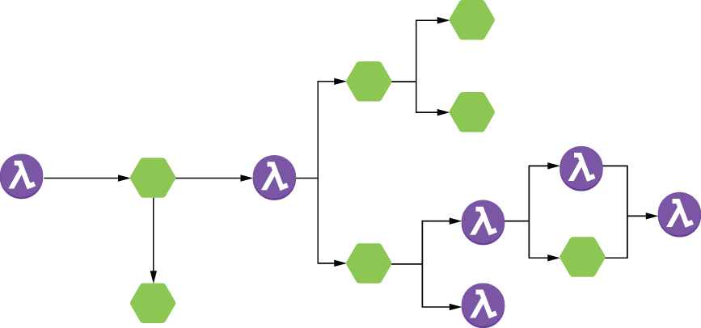
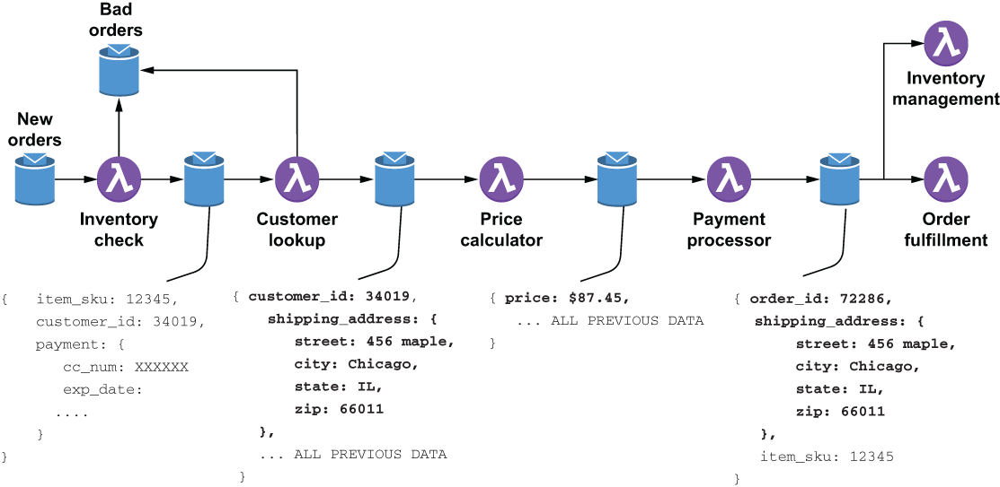

### 8.1.2 DataFlow programming

In contrast, dataflow programming focuses on the movement of data through a series of independent data processing functions that are connected via explicitly defined inputs and outputs. These predefined sequences of operations are commonly referred to as data pipelines and are what your Pulsar Functions applications should be modelled as. Here the focus is on moving the data through a series of stages, each of which processes the data and produces a new output. Each processing stage in a data pipeline should be able perform its processing based solely on the content of the incoming message. This eliminates any processing dependencies and allows each function to execute as soon as data is available.

A common analogy for a data pipeline is an assembly line in an automobile factory. Rather than assembling a car in one location piece by piece, each car passes through a series of stages during construction. A different piece of the car is added at each stage, but this can be done in parallel rather than sequentially. Consequently, multiple cars can be assembled in parallel, effectively increasing the throughput of the factory.

Pulsar Functions-based applications should be designed as topologies consisting of several individual Pulsar functions that perform the data processing operations and are connected together via Pulsar input and output topics. These topologies can be thought of as directed acyclic graphs (DAGs) with the functions/microservices acting as the processing units and the edges representing the input/out topic pairings used to direct data from one function to another, as shown in figure 8.1.

Figure 8.1 A Pulsar application is best represented as a data pipeline through which data flows from left to right through the functions and microservices to implement the business logic in a series of steps.

The data pipeline acts as a distributed processing framework where each function inside the data pipeline is an independent processing unit that can execute as soon as the next input arrives. Additionally, these loosely coupled components communicate asynchronously with one another, which allows them to operate at their own rates and not be blocked waiting for a response from another component. This, in turn, allows you to have multiple instances of any component running in parallel to provide the necessary throughput you require. Therefore, when you design your application, keep this in mind, as you will want to keep your functions and services as independent as possible to exploit this parallelism if needed. Let’s revisit the order entry use case to demonstrate how you would implement it as a data pipeline similar to the one shown in figure 8.2. As the term *dataflow* implies, it is best to focus on the flow of data shown along the bottom of the figure.

Figure 8.2 The data flow for the order entry use case. As the data flows through the various steps in the process, the original order data is augmented with additional information that will be used in the next step of the process.

As you can see, each step in the process passes the original order through along with an additional piece of information that is required in the subsequent step (e.g., the customer ID and shipping address have been added to the message by the customer lookup service). Since all of the data required for the processing at that stage is in the message, each function can execute as soon as the next piece of data arrives.

The payment processor removes the payment information from the message and publishes messages containing the newly generated order ID, the shipping address, and the item SKU. Multiple functions are consuming these messages; the inventory management function uses the SKU to decrease the item count from the available inventory, while the order fulfillment function needs the SKU and the shipping address to send the item to the customer. Hopefully, this gives you a better idea of how Pulsar Functions-based applications should be designed and modelled before we jump into some of the more advanced design patterns in the next section.
