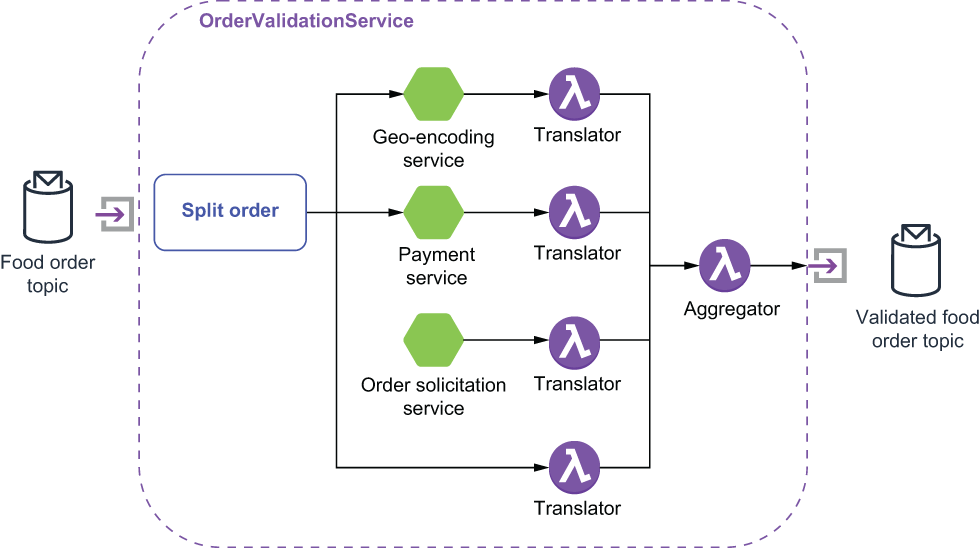

### 8.2.1 Splitter pattern

The OrderValidationService receives a message that contains three related pieces of information that must be validated in different ways: the delivery address, the payment information, and the food order itself. Validating each of these pieces of information requires interacting with an external service that may have a slow response time. A naïve approach to this problem would be to perform these steps in a serial fashion, one after another. However, this approach will result in very high latency time for each incoming order. This is due to the fact that when performing these three subtasks sequentially, the overall latency will be equal to the sum of the individual latencies.

Figure 8.3 The topology of the OrderValidationService is comprised of several other microservices and functions and utilizes the splitter pattern.

Since there are no dependencies between the results of these intermediate validation services (e.g., the payment validation isn’t dependent on the result of geo-encoding), a better approach would be to have each of these tasks performed in parallel. With parallel execution, the overall latency would be reduced to the latency of the longest-running subtask. In order to achieve this parallel subtask execution, the OrderValidationService will implement the *splitter* pattern to break out the individual elements of the message so they may be processed with different services. As you can see in figure 8.3, the OrderValidationService is composed of several smaller functions that implement the entire validation process.

Our solution should also be efficient in terms of its use of network resources and avoid sending the entire food order item to each microservice, since they only need a portion of the message to perform their processing. As you can see from the code in the next listing, we only send a portion of the message along with the order ID to each of these intermediate services. The order ID will be used to combine the results from these intermediate service calls into a final result, using the aggregator function.

Listing 8.1 The OrderValidationService’s Implementation of the splitter pattern

public class OrderValidationService implements Function\<FoodOrder, Void\> {\
    \
  private boolean initalized;\
  private String geoEncoderTopic, paymentTopic, \
  private String resturantTopic, orderTopic;\
 \
  @Override\
  public Void process(FoodOrder order, Context ctx) throws Exception {\
    if (!initalized) {\
        init(ctx);                                                       ❶\
    }\
        \
    ctx.newOutputMessage(geoEncoderTopic, AvroSchema.of(Address.class))\
      .property("order-id", order.getMeta().getOrderId() + "")           ❷\
       .value(order.getDeliveryLocation()).sendAsync();                  ❸\
    \
    ctx.newOutputMessage(paymentTopic, AvroSchema.of(Payment.class))\
      .property("order-id", order.getMeta().getOrderId() + "")\
      .value(order.getPayment()).sendAsync();                            ❹\
 \
    ctx.newOutputMessage(orderTopic, AvroSchema.of(FoodOrderMeta.class))\
      .property("order-id", order.getMeta().getOrderId() + "")\
      .value(order.getMeta()).sendAsync();                               ❺\
 \
     ctx.newOutputMessage(resturantTopic, AvroSchema.of(FoodOrder.class))\
      .property("order-id", order.getMeta().getOrderId() + "")\
      .value(order).sendAsync();                                         ❻\
 \
    return null;\
  }\
private void init(Context ctx) { \
  geoEncoderTopic = ctx.getUserConfigValue("geo-topic").toString();\
  paymentTopic = ctx.getUserConfigValue("payment-topic").toString();\
  resturantTopic = ctx.getUserConfigValue("restaurant-topic").toString();\
  orderTopic = ctx.getUserConfigValue("aggregator-topic").toString();\
  initalized = true;\
}

❶ Initialize all of the topic names so we know where to publish the messages.

❷ Add the order-ID to the message properties so we can use it to correlate the results.

❸ Send just the address element of the message to the GeoEncoder Service.

❹ Send just the Payment element of the message to the Payment Service.

❺ Send the food order metadata to the aggregator topic directly, since we don’t need to process it.

❻ Send just the FoodOrder element of the message to the OrderSolicititation Service.

The asynchronous nature of the processing of these individual message elements makes collecting the results challenging. Each of these elements is processed by different services with different response times (e.g., the geo-encoder will invoke a web service, the payment service needs to communicate with a bank to secure the funds, and each restaurant will need to respond manually to either accept or reject the order). These types of issues make the process of combing multiple, but related, messages complicated, which is where the *aggregator* pattern comes into play.

An aggregator is a stateful component that receives all of the response messages from the invoked services (e.g., GeoEncoder, Payment, etc.) and correlates the responses back together using the order ID. Once a complete set of responses has been collected, a single aggregated message is published to the output topic. When you choose to implement the aggregator pattern, you must consider the following three key factors:

- *Correlation*—How are messages correlated together?

- *Completeness*—When are we ready to publish the resulting message?

- *Aggregation*—How are the incoming messages combined into a single result?

For our particular use case, we have decided that the order ID will serve as the correlation ID, which will help us identify which response messages belong together. The result will be considered complete only after we have received all three messages for the order. This is also referred to as the “wait for all” strategy. Lastly, the resulting responses will be combined into a single object of type ValidatedFoodOrder.

Let’s take a look at the aggregator code shown in listing 8.2 for the implementation details. Given the strongly typed nature of Pulsar Functions, I cannot define the interface to accept multiple response object types (e.g., an AuthorizedPayment object from the Payment service, an Address type from the GeoEncoder service, etc.). Therefore, I use a translator function between these services and the OrderValidationAggregator. Each of these translator functions converts the intermediate services natural return type into a ValidatedFoodOrder object, which allows me to accept messages from each of these services within a single Pulsar function.

Listing 8.2 The OrderValidationService’s aggregator function

public class OrderValidationAggregator implements Function\<ValidatedFoodOrder, Void\> {\
 \
 @Override\
 public Void process(ValidatedFoodOrder in, Context ctx) throws Exception {\
        \
    Map\<String, String\> props = ctx.getCurrentRecord().getProperties();\
    String correlationId = props.get("order-id");\
        \
    ValidatedFoodOrder order;\
    if (ctx.getState(correlationId.toString()) == null) {              ❶\
      order = new ValidatedFoodOrder();\
    } else {\
      order = deserialize(ctx.getState(correlationId.toString()));     ❷\
    }\
        \
    updateOrder(order, in);                                            ❸\
        \
    if (isComplete(order)) {                                           ❹\
      ctx.newOutputMessage(ctx.getOutputTopic(),\
                            AvroSchema.of(ValidatedFoodOrder.class))\
        .properties(props)\
        .value(order).sendAsync();\
 \
      ctx.putState(correlationId.toString(), null);                    ❺\
    } else {\
      ctx.putState(correlationId.toString(), serialize(order));        ❻\
    }\
        \
    return null;\
}\
    \
private boolean isComplete(ValidatedFoodOrder order) {                 ❼\
  return (order != null && order.getDeliveryLocation() != null \
    && order.getFood() != null && order.getPayment() != null\
    && order.getMeta() != null);\
}\
    \
private void updateOrder(ValidatedFoodOrder val, \
                         ValidatedFoodOrder res) {                     ❽\
  if (res.getDeliveryLocation() != null \
     && val.getDeliveryLocation() == null) {\
    val.setDeliveryLocation(response.getDeliveryLocation());\
  }\
        \
  if (resp.getFood() != null && val.getFood() == null) {\
    val.setFood(response.getFood());\
  }\
        \
  if (resp.getMeta() != null && val.getMeta() == null) {\
    val.setMeta(response.getMeta());\
  }\
    \
  if (resp.getPayment() != null && val.getPayment() == null) {\
    val.setPayment(response.getPayment());\
  }\
        \
}\
 \
private ByteBuffer serialize(ValidatedFoodOrder order) throws IOException {\
    ...                                                                ❾\
}\
    \
private ValidatedFoodOrder deserialize(ByteBuffer buffer) throws IOException, \
➥ ClassNotFoundException {\
    ...                                                                ❿\
  } \
}

❶ Check to see if we have already received some responses for this order.

❷ If we have, then deserialize the bytes into a ValidatedFood-Order object.

❸ Every message will be of type ValidatedFoodOrder but will only contain one of the four fields.

❹ Check to see if we have received all four messages, which indicates that we are done.

❺ Once the order is aggre-gated, we can purge it.

❻ If not, serialize the object, and store it in the context until the next message arrives.

❼ An object is only considered complete if we have received all four messages.

❽ Copies over whatever fields are in the received object

❾ Helper method to convert a ValidatedFoodOrder object into a ByteBuffer

❿ Helper method to read a ValidatedFoodOrder object from a ByteBuffer

It is important to point out that due to the parallel nature of streaming architectures in general, the aggregator may receive messages from multiple orders at any time and in no particular order. Therefore, the aggregator maintains an internal list of active orders it has already received messages for. If no list exists for a given order ID, then it is assumed to be the first message in the collection, and an entry is added to the internal list. This list needs to be purged periodically to ensure it doesn’t grow indefinitely, which is why the aggregator makes sure to purge the list once an aggregation is complete.
