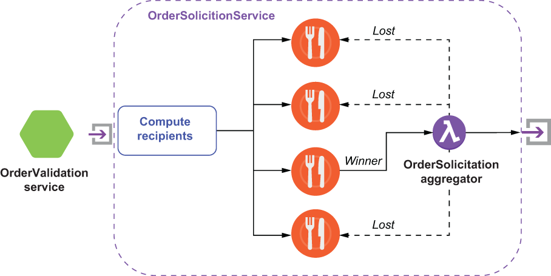

### 8.2.2 Dynamic router pattern

The *splitter* pattern is useful when you want to process different pieces of the message in parallel, and you already know in advance exactly how many elements you will have and that the number will remain static. However, there are situations where you cannot determine where the message will be routed ahead of time, and you must make that determination based on the content of the message itself and other external conditions. One such example is the OrderSolicitationService, which is one of the three microservices invoked by the OrderValidationService.

This service notifies a subset of participating restaurants of incoming food orders they can fulfill and awaits a response from each of the restaurateurs as to whether or not they will accept the order, and if so, when it will be ready for pick up. Obviously, the list of restaurants is dependent on several factors. We want to route the orders based on the restaurants’ ability to provide the food (i.e., orders for Big Macs go to McDonalds, etc.). At the same time, we don’t want to indiscriminately broadcast the order to every single McDonald’s restaurant, so we narrow the list down based on their proximity to the delivery location. Since this list is constructed in response to each message, the *recipient list* pattern is the best choice.

The overall flow of the OrderSolicitationService is depicted in figure 8.4, which consists of three distinct phases. The first phase computes the intended list of recipients based on the factors we’ve already discussed. During the second phase, the recipient list is iterated over, and the FoodOrder is forwarded to each recipient. The third and final phase is when the service awaits the responses from each of the recipients and selects a “winner” to fulfill the order. Once a winner is selected, all the other recipients are notified that they have “lost” and that the food order is no longer available.

Figure 8.4 The topology of the OrderSolicitationService, which implements the dynamic router pattern

The actual implementation of this logic is shown in listing 8.3 and relies on the message properties to convey metadata that is critical for the aggregator. First of all, the order ID is included within the message to identify which FoodOrder the response is associated with. The all-restaurants property is used to encode all of the candidates that have been solicited for this order. Having this information in the message enables the aggregator to know all of the restaurants it needs to send the “you didn’t win” message to. The last piece of metadata contained within the message properties is the return-addr property, which contains the name of the topic the aggregator is subscribed to. This allows us to avoid having to hard-code this information into each message recipient’s logic, and instead, we can provide this information dynamically. This is an implementation of the *return address* pattern defined in *Enterprise Integration Patterns*.

Listing 8.3 The OverSolicitationService’s implementation of the recipient list pattern

public class OrderSolicitationService implements Function\<FoodOrder, Void\> {\
 \
  private String rendevous = "persistent://resturants/inbound/accepted";\
    \
  @Override\
  public Void process(FoodOrder order, Context ctx) throws Exception {\
        \
  List\<String\> cand = getCandidates(order,\
                             order.getDeliveryLocation());                ❶\
        \
  if (CollectionUtils.isNotEmpty(cand)) {\
     String all = StringUtils.join(cand, “,”);\
     int delay = 0;\
     for (String topic: cand) {                                           ❷\
        try {\
         ctx.newOutputMessage(topic, AvroSchema.of(FoodOrder.class))\
           .property("order-id", order.getMeta().getOrderId() + "")       ❸\
           .property(“all-restaurants”, all)                              ❹\
           .property("return-addr", rendevous)                            ❺\
           .value(order).deliverAfter( (delay++ \* 10), TimeUnit.SECONDS); ❻\
        } catch (PulsarClientException e) {\
           e.printStackTrace();\
        }\
      } \
  }\
 \
  return null;\
 }\
 \
 private List\<String\> getCandidates(FoodOrder order, Address deliveryAddr) {\
  ...                                                                     ❼\
 }\
}

❶ Build the recipient list based on the order and delivery address.

❷ Send the FoodOrder to every recipient in the list.

❸ Use the order ID for correlation.

❹ Include all the restaurants so we can notify the losers.

❺ Tell each recipient where to send their response message.

❻ Stagger the delivery of the messages to minimize the number of rejected responses.

❼ The logic to build the recipient list

The recipient list is returned in order of preference (e.g., the restaurant closest to the delivery location, the one that has received the least amount of business from us tonight, etc.), and we use Pulsar’s delayed message delivery capabilities to space out the solicitation requests. The goal of this is to minimize the number of times we need to reject a FoodOrder that was accepted by a restaurant. We don’t want to aggravate our participating restauranteurs by bombarding them with orders that they accept but are ultimately rejected. Therefore, we scale up the number of restaurants we notify slowly to prevent having too many outstanding solicitations at the same time.

Since the OrderSolicitationService can send the FoodOrder to multiple recipients, it will need to reconcile the responses and award the order to only one of the respondents. While there are many strategies available, for now it will just accept the first response. This reconciliation logic will be implemented using an *aggregator* similar to the one we used for the OverValidationService. As you can see in listing 8.3, I am using the message properties to pass along the name of the topic that each of the recipients should respond to. The corresponding aggregator should be configured to listen to this topic, so it receives the response messages and can notify the non-winning restaurants that the order has been awarded to a different restaurant. This restauranteur’s mobile application can then react to the non-winning notification by removing the order from view.

Listing 8.4 The OverSolicitationService’s implementation of the aggregator pattern

public class OrderSolicitationAggregator implements Function\<SolicitationResponse, Void\> {\
 \
 @Override\
 public Void process(SolicitationResponse response, Context context) \
      throws Exception {\
 \
  Map\<String, String\> props = context.getCurrentRecord().getProperties();\
  String correlationId = props.get("order-id");\
  List\<String\> bids = Arrays.asList(\
    StringUtils.split(props.get("all-restaurants")));      ❶\
        \
  if (context.getState(correlationId) == null) {           ❷\
    // First response wins      \
    String winner = props.get("restaurant-id");            ❸\
    bids.remove(winner);                                   ❹\
    notifyWinner(winner, context);                         ❺\
    notifyLosers(bids, context);                           ❻\
            \
    // Record the time we received the winning bid.\
    ByteBuffer bb = ByteBuffer.allocate(32);\
    bb.asLongBuffer().put(System.currentTimeMillis());\
    context.putState(correlationId, bb);\
  } \
        \
  return null;\
}\
 \
private void notifyLosers(List\<String\> bids, Context context) {\
  ...\
}\
 \
private void notifyWinner(String s, Context context) {\
  ...\
  }\
}

❶ Decode all the IDs of all the solicited restaurants.

❷ First response back wins

❸ Get the restaurant ID of the winner from the response message.

❹ Remove the winner from the list of all restaurants.

❺ Send a message to the winning restaurant letting them know they won.

❻ Send a message to all the non-winning restaurants.

As you can see in listing 8.4, the correlation will still be done by the order ID, but the completeness criteria will be “first one wins” instead of waiting for a response from all the message recipients as we did for the splitter pattern. Even though we do our best to prevent sending multiple outstanding solicitation messages, the aggregator still needs to accommodate this scenario. It does so by retaining the time that the winning bid was received for each order. This allows the aggregator to ignore all subsequent responses for the same order, since we know that another restaurant has already been awarded the order. In order to prevent this data structure from growing too large and causing an out-of-memory condition, I have incorporated a background process that periodically wakes up and purges all records in the list that are older than a certain period of time, which can be determined by the timestamp of the winning bid.
