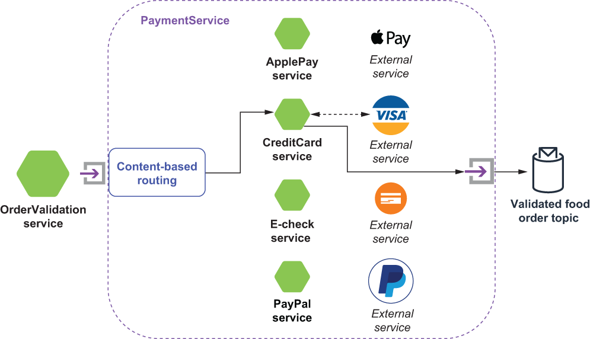

### 8.2.3 Content-based router pattern

A content-based router uses the message contents to determine which topic to route it to. The basic concept is that the content of each message is inspected and then routed to a specific destination based on values found or not found in the content. For the order validation use case, the PaymentService receives a message that will vary, depending on the payment type being used by the customer.

Currently, the system supports credit card payments, PayPal, Apple Pay, and electronic checks. Each of these payment methods must be validated by different external systems. Therefore, the goal of the PaymentService is to direct the message to the proper system based on the content of the message. Figure 8.5 depicts the scenario in which the method of payment on the order was a credit card, and the payment details are forwarded to the CreditCardService.

Figure 8.5 The PaymentService topology implements the content-based router pattern and routes the payment information to the appropriate service based on the method of payment provided with the order.

Each of the supported payment types has an associated intermediate microservice (e.g., ApplePayService, CreditCardService, etc.) that is configured with the proper credentials, endpoint, etc. These intermediate microservices then make a call to the proper external service to get payment authorization, and upon receipt of the authorization, forward the response on to the OrderValidationService’s aggregator, where it is combined with the other responses associated with the order. The next listing shows the implementation of the *content-based routing* pattern inside the PaymentService.

Listing 8.5 The PaymentService’s implementation of the content-based router pattern

  public class PaymentService implements Function\<Payment, Void\> {\
  private boolean initalized = false;\
  private String applePayTopic, creditCardTopic, echeckTopic, paypalTopic;\
    \
  public Void process(Payment pay, Context ctx) throws Exception {\
    if (!initalized) {\
      init(ctx);\
    }\
        \
    Class paymentType = pay.getMethodOfPayment().getType().getClass();\
    Object payment = pay.getMethodOfPayment().getType();\
        \
    if (paymentType == ApplePay.class) {\
      ctx.newOutputMessage(applePayTopic, AvroSchema.of(ApplePay.class))\
         .properties(ctx.getCurrentRecord().getProperties())\
        .value((ApplePay) payment).sendAsync();                          ❶\
    } else if (paymentType == CreditCard.class) {\
      ctx.newOutputMessage(creditCardTopic, AvroSchema.of(CreditCard.class))\
        ➥ .properties(ctx.getCurrentRecord().getProperties())\
        .value((CreditCard) payment).sendAsync();                        ❷\
    } else if (paymentType == ElectronicCheck.class) {\
      ctx.newOutputMessage(echeckTopic, AvroSchema.of(ElectronicCheck.class))\
         .properties(ctx.getCurrentRecord().getProperties())\
        .value((ElectronicCheck) payment).sendAsync();                   ❸\
    } else if (paymentType == PayPal.class) {\
      ctx.newOutputMessage(paypalTopic, AvroSchema.of(PayPal.class))\
         .properties(ctx.getCurrentRecord().getProperties())\
        .value((PayPal) payment).sendAsync();                            ❹\
    } else {\
      ctx.getCurrentRecord().fail();                                     ❺\
    }\
        \
    return null;\
  }\
    \
  private void init(Context ctx) {                                       ❻\
    applePayTopic = (String)ctx.getUserConfigValue("apple-pay-topic").get();\
    creditCardTopic = (String)ctx.getUserConfigValue("credit-topic").get();\
    echeckTopic = (String)ctx.getUserConfigValue("e-check-topic").get();\
    paypalTopic = (String)ctx.getUserConfigValue("paypal-topic").get();\
    initalized = true;\
  }\
}

❶ Send ApplePay objects to the ApplePayService.

❷ Send CreditCard objects to the CreditCardService.

❸ Send ElectronicCheck objects to the ElectronicCheckService.

❹ Send PayPal objects to the PayPalService.

❺ Reject any other payment method.

❻ The output topics for the intermediate services are configurable.

After the CreditCardService receives an authorization number for the transaction, it is then sent to the validatedFoodOrder topic, since we will need that authorization number to collect the funds.
