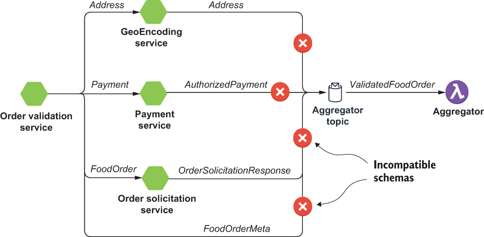
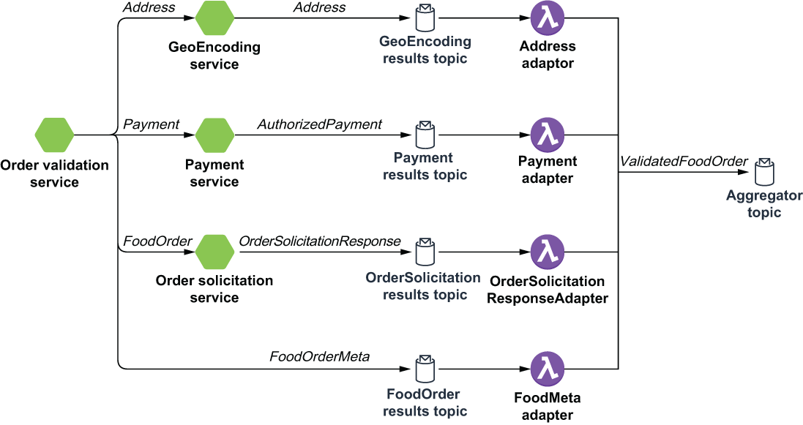

### 8.3.1 Message translator pattern

As we saw earlier, the OrderValidationService makes several asynchronous calls to different services, each of which produces messages with different schema types. All of these messages must be combined by the OrderValidationAggregator into a single response. However, a Pulsar function can only be defined to accept incoming messages of a single type, so we cannot publish these messages directly to the service’s input topic, as shown in figure 8.6, as the schemas would not be compatible.

Figure 8.6 Each of the intermediate microservices produce messages with different schema types. Therefore, they cannot publish them directly to the OrderValidationAggregator’s input topic.

To accommodate the consumption of messages with different schemas, the results from each of these intermediate microservices must be routed through a message translator function, which converts these response messages into the same type as the OrderValidationAggregator’s input topic, which, in this case, is the schema shown in listing 8.6. I have chosen to use an object type that is a composite of each of these message types. This approach allows me to simply copy the response from each of the intermediate services directly into the corresponding placeholder inside the ValidatedFoodOrder object.

Listing 8.6 The ValidatedFoodOrder definition

record ValidatedFoodOrder {\
  FoodOrderMeta meta;                                          ❶\
  com.gottaeat.domain.resturant.SolicitationResponse food;     ❷\
  com.gottaeat.domain.common.Address delivery_location;        ❸\
  com.gottaeat.domain.payment.AuthorizedPayment payment;       ❹\
}

❶ The FoodOrderMeta data forwarded from the OrderValidationService

❷ The response type from the OrderSolicitationService

❸ The response type from the GeoEncodingService

❹ The response type from the PaymentService

While the logic for consuming each response message type is slightly different, the concept is essentially the same. As you can see in listing 8.7, the logic for handling the AuthorizedPayment messages produced by the PaymentService is straightforward. Simply create an object of the appropriate type, and copy over the AuthorizedPayment object published by the PaymentService into the corresponding field in the wrapper object before sending it to the aggregator for consumption.

Listing 8.7 The PaymentAdaptor implementation

  public class PaymentAdapter implements Function\<AuthorizedPayment, Void\> {\
 \
    @Override\
    public Void process(AuthorizedPayment payment, Context ctx) \
           throws Exception {\
      ValidatedFoodOrder result = new ValidatedFoodOrder();    ❶\
      result.setPayment(payment);                              ❷\
        \
      ctx.newOutputMessage(ctx.getOutputTopic(),\
            AvroSchema.of(ValidatedFoodOrder.class))           ❸\
        .properties(ctx.getCurrentRecord().getProperties())    ❹\
        .value(result).send();\
        \
        return null;\
    }\
} 

❶ Create the new wrapper object.

❷ Update the payment field with the Authorized-Payment.

❸ Publish a message of type ValidatedFoodOrder to the aggregator’s input topic.

❹ Copy over the order ID so we can correlate it with the other response messages.

There are similar adaptors for each of the other microservices as well. Once all of the object values have been populated, the order is considered validated and can be published to the validatedFoodOrder topic for further processing.

Figure 8.7 Each of the intermediate microservices publish their response messages to topics with the appropriate schema type. The associated adapter functions then consume those messages and convert them to the ValidatedFoodOrder schema type expected in the aggregator topic.

It is worth noting that each of these adaptor functions must consume from a topic that stores the microservice’s respective response messages before publishing the wrapper objects to the OrderValidationAggregator’s input topic. Therefore, you will need to create these response topics and configure the microservices to publish to them, as shown in figure 8.7. In addition to being useful in situations where you need to combine the results of several different Pulsar functions, this pattern can also be used to accommodate the ingestion of data from external systems, such as databases, and translate them into the required schema format for processing.
