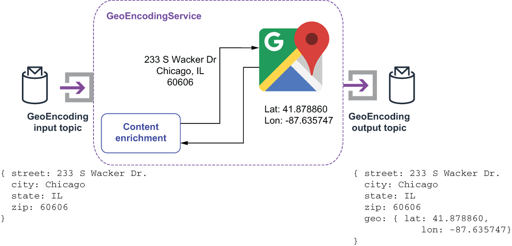

### 8.3.2 Content enricher pattern

When processing streaming events, it is often useful to augment the incoming message with additional information that the downstream system requires. In our example, the incoming customer order event to the OrderValidationService will contain a raw, unvalidated street address, but the consuming microservices also require a geo-encoded location with a latitude and longitude pair to provide navigation to the delivery drivers.

This type of problem is typically addressed with the *content enricher pattern*, which is the term for a process that uses information inside an incoming message to augment the original message contents with the new information. In our particular use case, we will retrieve data from an external source and add it to the outgoing message, as shown in figure 8.8. Our GeoEncodingService will take the delivery address details provided by the customer and pass them to the Google Maps API web service. The resulting latitude and longitude that corresponds to the address will then be included in the outbound message.

Figure 8.8 The GeoEncoderService implements the content enrichment pattern by using the provided street address to look up the corresponding latitude and longitude and add it to the address object.

The following listing shows the implementation of the GeoEncodingService that invokes the Google Maps service and augments the incoming Address object with the associated latitude and longitude value.

Listing 8.8 The GeoEncoderService’s implementation of the content enricher pattern

public class GeoEncoderService implements Function\<Address, Address\> {\
  boolean initalized = false;\
  String apiKey;\
  GeoApiContext geoContext;\
    \
  public Void process(Address addr, Context context) throws Exception {\
    if (!initalized) {\
      init(context);\
    }\
        \
    Address result = new Address();\
    result.setCity(addr.getCity());\
    result.setState(addr.getState());\
    result.setStreet(addr.getStreet());\
    result.setZip(addr.getZip());\
        \
    try {\
      GeocodingResult\[\] results = \
         GeocodingApi.geocode(geoContext, formatAddress(addr)).await();\
    \
      if (results != null && results\[0\].geometry != null) {\
         Geometry geo = results\[0\].geometry;\
        LatLon ll = new LatLon();\
        ll.setLatitude(geo.location.lat);\
          ll.setLongitude(geo.location.lng);\
          result.setGeo(ll);\
        }\
            \
        } catch (InterruptedException \| IOException \| ApiException ex) {\
          context.getCurrentRecord().fail();\
          context.getLogger().error(ex.getMessage());\
        } finally {\
          return result;\
        }\
    }\
 \
    private void init(Context context) {\
      apiKey = context.getUserConfigValue("apiKey").toString();\
      geoContext = new GeoApiContext.Builder()\
                .apiKey(apiKey).maxRetries(3)\
               .retryTimeout(3000, TimeUnit.MILLISECONDS).build();\
      initalized = true;\
    }\
}

The service uses an API key provided by the configuration properties to invoke the Google Maps web service and uses the first response it gets as the source of the latitude and longitude values. If the call to the web service isn’t successful, we fail the message so it can be retried at a later time.

While using an external service is one of the most common uses for the *content enrichment pattern*, there are implementations that merely perform internal calculations based on the message contents, such as computing the message size or MD5 hash of the message contents and adding that to the message properties. This allows the message consumer to validate that the message contents have not been altered.

Another common use case is to retrieve the current time from the operating system and append that timestamp to the message to indicate when it was received or processed. This information is useful for maintaining the message order if you wish to process the messages in the order they were received, or for identifying bottlenecks in the DAG if you appended a received timestamp at each step of the process.
