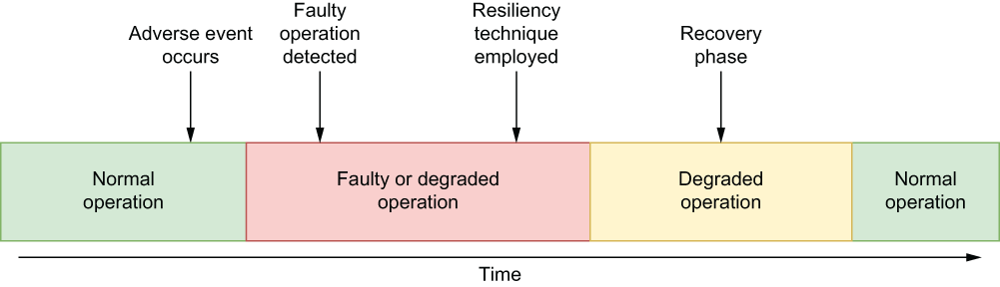

# 9 Resiliency patterns

This chapter covers

- Making your Pulsar Functions-based applications resilient to adverse events

- Implementing well-established resiliency patterns using Pulsar Functions

As the architect of the GottaEat order entry microservice, your primary goal is to develop a system that can accept incoming food orders from customers 24 hours a day, 7 days a week, and within a response time acceptable to the customer. Your system must be available at all times; otherwise, your company will not only lose revenue and customers, but its reputation will suffer as well. Therefore, you must design your system to be both highly available and resilient to provide continuity of service. Everyone wants their systems to be resilient, but what does that actually mean? Resilience is the ability of a system to withstand disruptions caused by adverse events and conditions, while maintaining an acceptable level of performance relative to any number of quantitative metrics, such as availability, capacity, performance, reliability, robustness, and usability.

Being resilient is important because no matter how well your Pulsar application is designed, an unanticipated incident, such as the loss of electrical power or network communications, will eventually emerge and disrupt the topology. Implicit in this statement is the idea that adverse events and conditions will occur. It really isn’t a matter of if but when. Resiliency is about what your software does when these disruptive events occur. Does the Pulsar function detect these events and conditions? Does it properly respond to them once they are detected? Does the function properly recover afterward?

A highly resilient system will utilize several reactive resiliency techniques to actively detect these adversities and respond to them to return the system back to its normal operating state automatically, as shown in figure 9.1. This is particularly useful in a streaming environment, where any disruption of service can result in the data not being captured from the source and being lost forever.

Figure 9.1 A resilient system will automatically detect adverse events or conditions and take proactive measures to return itself to a normal operating state.

Obviously, the key to employing any reactive technique is the ability to detect the adverse conditions. In this chapter we will cover how to detect faulty conditions with a Pulsar Functions application and some of the resiliency techniques you can use within your Pulsar functions to make them more resilient.

## 子目录

- [9.1 Pulsar Functions resiliency](<9-resiliency-patterns/9.1-pulsar-functions-resiliency.md>)
- [9.2 Resiliency design patterns](<9-resiliency-patterns/9.2-resiliency-design-patterns.md>)
- [9.3 Multiple layers of resiliency](<9-resiliency-patterns/9.3-multiple-layers-of-resiliency.md>)
- [Summary](<9-resiliency-patterns/summary.md>)
