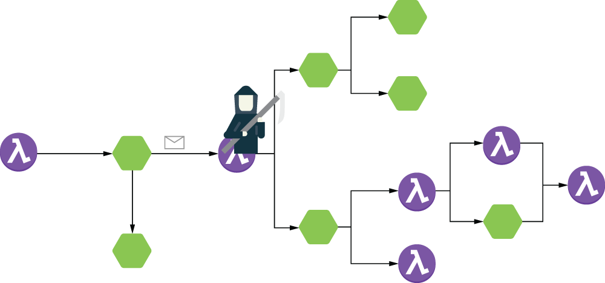
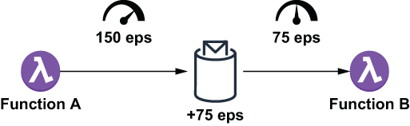
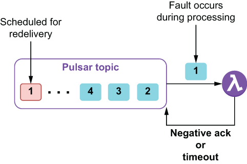

### 9.1.1 Adverse events

In order to implement an overall resiliency strategy, we must first identify all of the adverse events that could potentially impact a running Pulsar application topology. Rather than attempting to list out every single possible condition that can occur with a Pulsar function, we will classify the adverse events into the following categories: function death, lagging function, and non-progressing function.

Function death

Let’s start with the most drastic event first, *function death*, which is when a Pulsar function within the application topology terminates abruptly. This condition can be caused by any number of physical factors, such as a server crash or power outage, or non-physical factors, such as an out-of-memory condition within the function itself. Regardless of the underlying reason, the impact on the system will be severe, as data flowing through the DAG will come to an abrupt halt.

If the function shown in figure 9.2 dies, all of the downstream consumers will stop receiving messages, and the DAG will be essentially blocked at this point in the flow. From an end-user perspective, the application will have stopped producing output, which in our situation, means that the entire food order entry process will come to a screeching halt.

Figure 9.2 When a function dies and stops consuming messages, the entire application is essentially blocked at that point in the DAG, and all downstream processing will stop.

Fortunately, the functions input topic will act as a buffer and retain the incoming messages up to the limit imposed by the message retention policy for the topic. I only mention this caveat to impress upon you the importance of resolving this issue sooner rather than later because eventually messages could get dropped if the function is not restarted.

If you are using the recommend Kubernetes runtime to host your Pulsar functions, then the Pulsar Functions framework will automatically detect the failure of the associated K8s pod and restart it for you as long as you have sufficient computing resources in your Kubernetes environment. You should also have proper monitoring and alerting in place to detect the loss of a physical host and respond accordingly as an additional layer of resiliency.

Lagging function

Another condition that will have a negative impact on the performance of a Pulsar application is the *lagging function,* which occurs when there is a *sustained* arrival rate of messages into a function’s input topic that is greater than the function is capable of processing. Under these circumstances, the function will fall further and further behind in the processing of the incoming messages, which will lead to a growing lag between the time a message is ready to be processed and when it eventually is processed.

Let’s consider a scenario where function A is publishing 150 events per second to another function’s input topic, as shown in figure 9.3. Unfortunately, function B can only process 75 events per second, which leaves a 75-event-per-second deficit that is getting buffered inside the topic. If this processing imbalance remains in place, the volume of messages within the input topic will continue to grow.

Figure 9.3 Function B is only able to process 75 events per second, while function A is producing events at a rate of 150 per second. This leads to a backlog of 75 events per second, which introduces one second of latency per second.

Initially, this lag will start to impact the business SLA, and in our use case, the order entry process will be slow for our customers, as they have to wait for their orders to get processed and confirmed. Eventually, the lag will be too great for customers to bear, and they will abandon their orders due to the lack of responsiveness of the mobile application. This could lead to situations where the customer’s order is placed into the queue and processed *after* the customer has decided, due to lack of a response, that their order was never placed, which would be a nightmare from a business perspective, as we would have to refund the charged amount and notify the restaurant that the order had been cancelled.

To put some numbers behind this statement, let’s imagine the scenario where such a condition was to start inside our order validation DAG during a peak business time, such as a Friday night around 7 p.m. Orders that were placed 10 minutes later would be placed behind the 45,000 (75 eps × 60 sec × 10 minutes) other orders that have built up inside function B’s input topic. At a processing rate of 75 per second, it would take 10 minutes to process those existing messages before finally processing the order. Thus, an order placed at 7:10 wouldn’t get processed until after 7:20 pm! Therefore, in order to meet your business SLAs and avoid abandoned orders due to a lagging function, we will need to conduct performance testing to determine the average processing rate of each function in the order validation service and continuously monitor it for any processing imbalance in the future.

Fortunately, if you are using the recommended Kubernetes runtime to host your Pulsar functions, then the Pulsar Functions framework allows you to scale up the parallelism of any function using the command shown in listing 9.1, which should help alleviate the imbalance. Therefore, the remedy for this adverse event is to update the function’s parallelism count to an acceptable level. Since the message input-versus-consumed ratio is 2:1 in our hypothetical example, you would want the ratio of function A versus function B instances to be at least the same, if not more.

Listing 9.1 Increasing the function parallelism

\$ bin/pulsar-admin functions update \\\
  --name FunctionA \\\
  --parallelism 5 \\\
  ...

While adjusting the ratio of instances to be exactly 2:1 would theoretically alleviate the problem, I recommend having one or two additional instances beyond that ratio on the consumer side. Not only will this provide excess processing capacity that will allow your application to handle any additional surge in messages, but it will also make your function resilient to the loss of one or more instances before any lag is experienced.

Non-progressing function

A *non-progressing function* is different from a lagging function in two aspects; the first is their ability to successfully process messages. With a lagging function, all of the messages are processed successfully, albeit at too slow of a pace to keep up, whereas with a non-progressing function, some or all of the messages cannot be processed successfully.

The second aspect is the way in which the problem can be resolved. With a lagging function, the most common remedy is to increase the parallelism of the function instances to accommodate the incoming message volume. Unfortunately, there is no easy fix for a non-progressing function, and the only resolution is to add processing logic inside the Pulsar function itself to detect and react to these processing exceptions. So, let’s take a step back and review the limited number of options we have when dealing with processing exceptions within a Pulsar function.

You can effectively ignore the error entirely and explicitly acknowledge the message, which tells the broker that you are done processing it. Obviously, this is not a viable option for some use cases, such as our payment service where we need an authorized payment to continue processing the order. Another option is to negatively acknowledge (i.e., negative ack) the message within a catch block of your Pulsar function code, which tells the broker to redeliver the message Lastly, there is the possibility that no acknowledgment is sent from your function at all due to an uncaught exception or a network timeout when calling a remote service. As you can see from figure 9.4, in either case these messages will be marked for redelivery.

Figure 9.4 When a Pulsar function sends a negative acknowledgement or fails to acknowledge a message within the configured time, the message is scheduled for redelivery after a one-minute delay.

As more and more of these negatively acknowledged messages build up in the topic, the system will gradually slow, as they are repeatedly tried, fail, and tried again. This wastes processing cycles on non-productive work, and what’s worse is that these messages will never get cleared from the topic, which will only compound their impact over time—hence, the term *non-progressing function*, as it is failing to make progress on the new messages.

Let’s revisit the scenario in which a function can successfully process 75 events per second, and that function is making a call to a remote service, such as a credit card authorization service. Furthermore, the endpoint that the function is calling is actually a load balancer, which distributes the calls across three different instances of the service, and one of them goes down. Every third message will immediately throw an exception, and the message will be negatively acked, resulting in approximately 25 events per second not succeeding. This would drop the effective processing rate of the function from 75 eps to 50 eps. This decrease in the processing rate is the first telltale sign of a non-progressing function.

Scaling up the instances will not solve the problem either because that will also scale up the number of faults at a commensurate rate. If we were to double the parallelism of the functions to achieve a 150 eps consumption rate, we would end up with 50 eps that are failing and getting reprocessed. In fact, no matter how many instances we add, a third of all messages will still need reprocessing. It is also worth noting that each of these reprocessed messages will experience a one-minute latency penalty as well, which will have a negative impact on your application’s perceived responsiveness.

Now let’s consider the impact of a network outage on this same function. Every time a message is processed, a call is made to the load balancer, but since the network is down, we cannot reach it. Not only do 100% of the messages fail, but each message takes 30 seconds to process, since it has to wait for a network timeout exception to be thrown. The impact to the DAG will be the same as if the function had died, but unfortunately it hasn’t. Instead, this function is effectively in a zombie state, and even restarting the function won’t help, since the underlying issue is external to the function itself.

While the underlying issues preventing the messages from being processed can be vastly different, they can be classified into two broad categories based on their likelihood of self-correcting: *transient faults* and *non-transient faults*. Transient faults include the temporary loss of network connectivity to components and services, the momentary unavailability of a service, or timeouts that can occur when your Pulsar function calls a remote service that is busy. These types of faults are often self-correcting, and if the message is reprocessed after a suitable delay, it is likely to succeed. One such scenario would be if the payment service is making a call to an external credit card authorization service during a period when the service is overloaded with requests. There is a high probability of a subsequent call succeeding once the service has had a chance to recover.

Non-transient faults, in contrast, require external intervention in order to be resolved and include things like catastrophic hardware failures, expired security credentials, or bad message data. Consider the scenario where the order validation service publishes a message to the payment service’s input topic that contains invalid payment information, such as a bad credit card number. No matter how many times we attempt to get authorization to use the card as a method of payment, it will always be declined. Another potential scenario would be where our credentials for the payment service have expired, and consequently, all of our attempts to authorize *any* customer’s credit card will fail.

Oftentimes, it will be difficult to distinguish one scenario from the other, and we need to be able to detect non-transient faults, such as the invalid credit card number, from transient faults, such as an overloaded remote service, so we can respond to them differently. Fortunately, we can use the corresponding exception types and other data to make intelligent guesses as to the transient nature of a given fault and determine the proper course of action accordingly.
