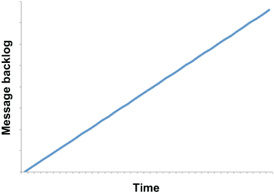

### 9.1.2 Fault detection

When it comes to the detection of faulty conditions within a Pulsar Functions topology, one only needs to examine the degree to which data is flowing through the entire topology. Simply put, is the application keeping up with the data volume being fed to it from the input topic, or is it falling behind? Data should flow through the DAG just like blood flowing through your body: uninterrupted and at a steady pace. There shouldn’t be any blockages that are cutting off the flow to certain areas.

All of the adverse events we have discussed thus far have a similar impact on the flow of data: a steady increase in unprocessed messages. Within Pulsar, the key metric that indicates such a blockage is message backlog. The presence of an ever-increasing message backlog at the Pulsar application’s input topic is an indication of degraded or faulty operation. To be clear, I am not talking about the absolute number of messages in the backlog but rather the *trend* of that number itself over a period of time, such as your peak business hours.

When a Pulsar application or function cannot keep up with the growing data volume in its input topic, as shown in figure 9.5, this condition is known as *backpressure* and is indicative of a lack of processing capacity and degraded performance within the application, which must be remedied to meet the business SLAs. The term backpressure is borrowed from fluid dynamics and used to indicate some resistance or opposing force restricting the desired flow of data through the topology just like a clog in your kitchen sink creates an opposing force to the water draining. Similarly, this condition is not isolated to the Pulsar function that is consuming the messages, but also has an impact throughout the entire topology.

Figure 9.5 The condition where the message backlog for a particular subscription increases steadily over time is referred to as backpressure and is indicative of degraded performance within a Pulsar function or application.

All of the adverse events we have discussed thus far—function death, function lag, and non-progressing functions—can be detected by the presence of backpressure on the function’s input topic(s). You should monitor the following topic-level metrics to detect backpressure within a Pulsar function:

- pulsar_rate_in, which measures the rate at which messages are coming into the topic in messages per second

- pulsar_rate_out, which measures the rate at which messages are being consumed from the topic in messages per second

- pulsar_storage_backlog_size, which measures the total backlog size of the topic in bytes

All of these metrics are periodically published to Prometheus and can be monitored by any observability framework that integrates with that platform. Any increase in message backlog within any of the function’s input topics is indicative of one or more of these events and should trigger an alert.
