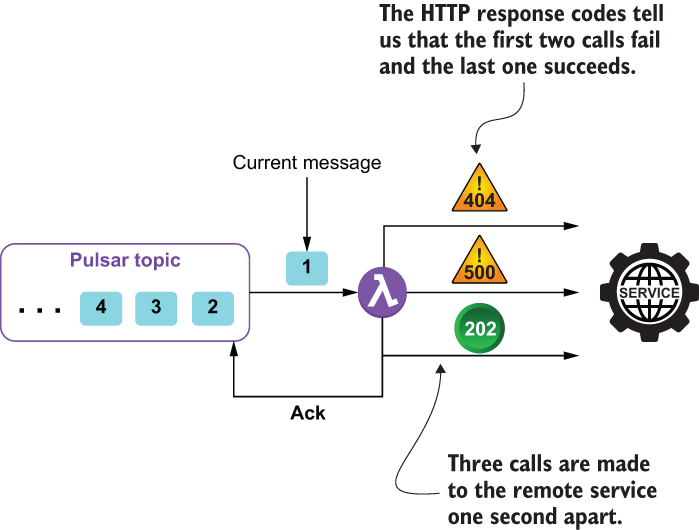

### 9.2.1 Retry pattern

When communicating with a remote service, any number of transient faults may occur, including a loss of network connectivity, the temporary unavailability of a service, and service timeouts that can occur when the remote service is extremely busy. These types of faults are generally self-correcting, and subsequent calls to the service are likely to succeed. If you encounter such a failure inside your Pulsar function, then the *retry* pattern allows you to handle the failure in one of three ways, depending on the error; if the error indicates that the failure isn’t transient in nature, such as an authentication failure due to bad credentials, then you should not retry the call, since the same failure is likely to occur.

If the exception indicates that the connection either timed out or otherwise indicates that the request was rejected due to the system being busy, then it is best to wait for a period of time before retrying the call to allow the remote service time to recover. Otherwise, you may want to retry the call immediately, since you have no reason to believe the subsequent call will fail. In order to implement this type of logic inside your function, you will need to wrap the remote service call inside a decorator, as shown in the following listing.

Listing 9.3 Utilizing the retry pattern inside a Pulsar function

import io.github.resilience4j.retry.Retry;\
import io.github.resilience4j.retry.RetryConfig;\
import io.github.resilience4j.retry.RetryRegistry;           ❶\
import io.vavr.CheckedFunction0;\
import io.vavr.control.Try;\
 \
public class RetryFunction implements Function\<String, String\> {\
 \
  public String apply(String s) {                            ❷\
                \
    RetryConfig config = \
       RetryConfig.custom()                                  ❸\
         .maxAttempts(2)                                     ❹\
         .waitDuration(Duration.ofMillis(1000))              ❺\
         .retryOnResult(response -\> (response == null))      ❻\
         .retryExceptions(TimeoutException.class)            ❼\
         .ignoreExceptions(RuntimeException.class)           ❽\
         .build();\
        \
    CheckedFunction0\<String\> retryableFunction = \
       Retry.decorateCheckedSupplier(\
        RetryRegistry.of(config).retry("name"),              ❾\
        () -\> {                                              ❿\
          HttpGet request = \
             new HttpGet("http://www.google.com/search?q=" + s);\
 \
          try (CloseableHttpResponse response = \
                  HttpClients.createDefault().execute(request)) {\
            HttpEntity entity = response.getEntity();\
            return (entity == null) ? null : EntityUtils.toString(entity);\
          }\
       });\
        \
    Try\<String\> result = Try.of(retryableFunction);          ⓫\
    return result.getOrNull();                               ⓬\
  }\
}

❶ We rely on several classes within the resilience4j library.

❷ This is the method defined in the function interface that will be invoked for each message.

❸ Create our own custom retry configuration.

❹ Specifies a maximum of two retry attempts

❺ Specifies a pause of one second between retries

❻ Perform a retry if the returned result is null.

❼ Specifies the list of exceptions that are treated as transient faults and retried

❽ Specifies the list of exceptions that are treated as non-transient and not retried

❾ Decorate the function with our custom retry configuration.

❿ Provide the lambda expression that will be executed and retried if necessary.

⓫ Execute the decorated function until a result is received or the retry limit is reached.

⓬ Return the result or null if no response was received.

The code shown in listing 9.2 simply takes as input a string, calls the Google search API with the given input string, and returns the result. Most importantly, it will make multiple attempts to call the HTTP endpoint without having to negatively acknowledge the message and have it redelivered to the function. Instead, the message is delivered from the Pulsar topic just once, and the retries are all made within the same call to the Pulsar function’s apply method, as shown in figure 9.6. This allows us to avoid the wasteful cycle of having the same message delivered multiple times before deciding to give up on the external system.

Figure 9.6 When using the retry pattern, the remote service is called repeatedly with the same message. In this particular case, the first two calls fail, but the third one succeeds, so the message is acknowledged. This allows us to avoid having to negatively ack the message and delay the processing by one minute each time.

The first parameter passed into the Retry.decorateCheckedSupplier method is the retry object we configured earlier in the code, which defines the number of retry attempts to make, how long to pause between them, and which exceptions indicate that we should retry the function call and which ones indicate we should not.

For those of you not familiar with the use of lambda expressions inside Java, the actual logic that will be called is encapsulated inside the second parameter, which takes in a function definition, as indicated by the ()-\> syntax, and includes all the code inside the following brackets. The resulting object is a decorated function that is then passed into the Try.of method, which handles all of the retry logic automatically for you. The term *decorated* comes from the decorator pattern, which is a well-known design pattern that allows behavior to be dynamically added to an object runtime.

While you could have implemented similar logic using a combination of try/catch statements and a counter for the number of attempts, one can easily argue that the decorated function approach provided by the resilience4j library is a much more elegant solution which also allows you to dynamically configure the retry properties via user configuration properties provided when the Pulsar function is deployed.

Issues and considerations

While this is a very useful pattern to use when interacting with an external system, such as a web service or a database, be sure to consider the following factors when implementing it inside your Pulsar function:

- Adjust the retry interval to match the business requirements of your application. An overly aggressive retry policy with very short intervals between retries could generate additional load on a service that is already overloaded, making matters even worse. One might want to consider using an exponential backoff policy that increases the time between the retries in an exponential manner (e.g., 1 sec, 2 sec, 4 sec, 8 sec, etc.).

- Consider the criticality of the operation when choosing the number of retries to attempt. In some scenarios it may be best to fail fast rather than impact the processing latency with multiple retry attempts. For a customer-facing application, for example, it is better to fail after a small number of retries with a short delay between them than to introduce a lengthy delay to the end user.

- Be careful when using this pattern on operations that are idempotent; otherwise you might experience unintended side effects (e.g., a call made to an external credit card authorization service that is received and processed successfully but fails to send a response). Under these circumstances, if the retry logic sends the request again, the customer’s credit card would be charged twice.

- It is important to log all retry attempts so the underlying connectivity issues can be identified and corrected as soon as possible. In addition to regular log files, Pulsar metrics can be used to communicate the number of retry attempts to the Pulsar administrator.
