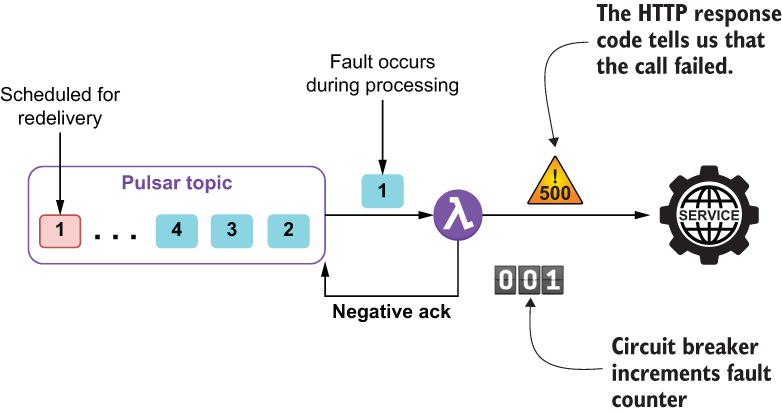
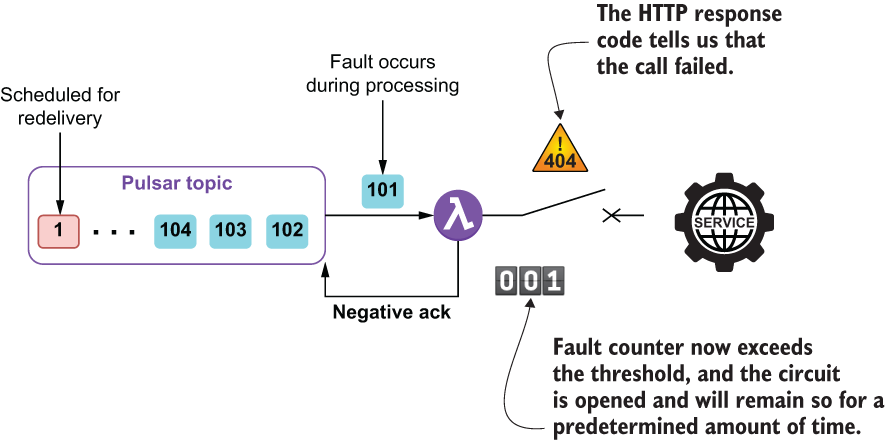
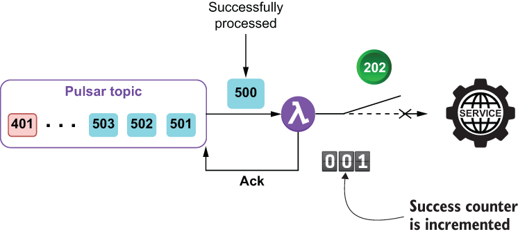

### 9.2.2 Circuit breaker pattern

The retry pattern was designed to handle transient faults because it enables an application to retry an operation in the expectation that it will succeed. The *circuit breaker pattern*, on the other hand, prevents an application from performing an operation that is likely to fail due to a non-transient fault.

The circuit breaker pattern, which was popularized by Michael Nygard in his book *Release It!* (Pragmatic Bookshelf, 2nd ed., 2018), is designed to prevent overwhelming a remote service with additional calls when we already know that it is has been unresponsive. Therefore, after a certain number of failed attempts, we will consider that the service is either unavailable or overloaded and reject all subsequent calls to the service. The intent is to prevent the remote service from becoming further overloaded by bombarding it with requests that we already know are unlikely to succeed.

The pattern gets its name from the fact that its operation is modelled after the physical electric circuit breakers found inside houses. When the number of faults within a given period of time exceeds a configurable threshold, the circuit breaker *trips*, and all invocations of the function that is decorated with the circuit breaker will fail immediately. The circuit breaker acts as a state machine that starts in the *closed* state, which indicates that the data can flow through the circuit breaker.

As we can see in figure 9.7, all incoming messages result in a call to the remote service. However, the circuit breaker keeps track of how many calls to the service produce an exception. When the number of exceptions exceeds a configured threshold, it is an indication that the remote service is either unresponsive or too busy to process additional requests. Therefore, in order to prevent additional load on an already overloaded service, the circuit breaker transitions to the open state, as shown in figure 9.8. This is analogous to what an electrical circuit breaker does when it experiences an electrical surge and trips (opens) the circuit to prevent the flow of electricity into an already overloaded power outlet.

Figure 9.7 A circuit breaker starts in the closed state, which means that the service will be called for every message that is processed. The service call made when processing message 1 throws an exception, so the fault counter is incremented, and the message is negatively acked. If the counter exceeds the configured threshold, the circuit breaker will trip and transition to an open state.

Once the circuit breaker has been tripped, it will remain so for a preconfigured amount of time. No calls will be made to the service until that time period has expired. This gives the service time to fix the underlying issue before allowing the application to resume making calls to it. After the time period has elapsed, the circuit transitions to the *half-open* state in which a limited number of requests are permitted to invoke the remote service.

Figure 9.8 Once the circuit breaker’s fault counter exceeds the configured threshold, the circuit transitions to the open state, and all subsequent messages are immediately negatively acked. This prevents making additional calls to a service that are likely to fail and gives the service some time to recover.

The half-open state is intended to prevent a recovering service from being flooded with requests from all the backlogged messages. As the service recovers, its capacity to handle requests might be limited at first. Only sending a limited number of requests prevents the recovering system from being overwhelmed after it has recovered. The circuit breaker maintains a success counter that is incremented for every message that is allowed to invoke the service and completes successfully, as shown in figure 9.9.

Figure 9.9 When the circuit breaker is in the half-open state, a limited number of messages are permitted to invoke the service. Once a sufficient number of these calls complete successfully, the circuit transitions back to the closed state. However, if any of the messages fail, the circuit breaker immediately transitions back to the open state.

If all of these requests are successful, as indicated by the success counter, it is assumed that the fault that was causing the previous issue has been resolved and that the service is ready to accept requests again. Thus, the circuit breaker will then switch back to the closed state and resume normal operations. However, if any of the messages sent during the half-open state fail, the circuit breaker will immediately switch back to the open state (no failure count threshold applies) and restart the timer to give the service additional time to recover from the fault.

This pattern provides stability to the application while the remote service recovers from a non-transient fault by quickly rejecting a request that is likely to fail and might lead to cascading failures throughout the entire application. Oftentimes, this pattern is combined with the retry pattern to handle both transient and non-transient faults within the remote service. To utilize the circuit breaker pattern inside your Pulsar function, you need to wrap the remote service call inside a *decorator*, as shown in listing 9.4 which shows the implementation of the CreditCardAuthorizationService that is called from the GottaEat payment service when the customer uses a credit card for payment.

Listing 9.4 Utilizing the circuit breaker pattern inside a Pulsar function

...\
import io.github.resilience4j.circuitbreaker.\*;                      ❶\
import io.vavr.CheckedFunction0;\
import io.vavr.control.Try;\
 \
public class CreditCardAuthorizationService \
    implements Function\<CreditCard, AuthorizedPayment\> {\
    \
  public AuthorizedPayment process(CreditCard card, Context ctx) \
     throws Exception {\
        \
    CircuitBreakerConfig config = CircuitBreakerConfig.custom()\
      .failureRateThreshold(20)                                      ❷\
      .slowCallRateThreshold(50)                                     ❸\
      .waitDurationInOpenState(Duration.ofMillis(30000))             ❹\
      .slowCallDurationThreshold(Duration.ofSeconds(10))             ❺\
      .permittedNumberOfCallsInHalfOpenState(5)                      ❻\
      .minimumNumberOfCalls(10)                                      ❼\
      .slidingWindowType(SlidingWindowType.TIME_BASED)               ❽\
         .slidingWindowSize(5)                                       ❾\
         .ignoreException(e -\> e instanceof\
            UnsuccessfulCallException && \
        ((UnsuccessfulCallException)e).getCode() == 499 )            ❿\
      .recordExceptions(IOException.class, \
                        UnsuccessfulCallException.class)             ⓫\
     .build();\
        \
    CheckedFunction0\<String\> cbFunction = \
      CircuitBreaker.decorateCheckedSupplier(\
         CircuitBreakerRegistry.of(config).circuitBreaker("name"),   ⓬\
         () -\> {                                                     ⓭\
        OkHttpClient client = new OkHttpClient();\
        StringBuilder sb = new StringBuilder()\
          .append("number=").append(card.getAccountNumber())\
          .append("&cvc=").append(card.getCcv())\
          .append("&exp_month=").append(card.getExpMonth())\
          .append("&exp_year=").append(card.getExpYear());\
 \
        MediaType mediaType = \
               MediaType.parse("application/x-www-form-urlencoded");\
        RequestBody body = \
               RequestBody.create(sb.toString(), mediaType);\
 \
        Request request = new Request.Builder()\
           .url("https://noodlio-pay.p.rapidapi.com/tokens/create")\
           .post(body)\
           .addHeader("x-rapidapi-key", "SIGN-UP-FOR-KEY")\
           .addHeader("x-rapidapi-host", "noodlio-pay.p.rapidapi.com")\
           .addHeader("content-type", \
                          "application/x-www-form-urlencoded")\
           .build();\
        try (Response response = client.newCall(request).execute()) {\
          if (!response.isSuccessful()) {\
             throw new UnsuccessfulCallException(response.code());\
          }\
          return getToken(response.body().string());\
        }\
          }\
        );\
            \
        Try\<String\> result = Try.of(cbFunction);                    ⓮\
        return authorize(card, result.getOrNull());                 ⓯\
      }\
    \
    private String getToken(String json) {\
      ...\
    }\
    \
    private AuthorizedPayment authorize(CreditCard card, String token) {\
      ...\
    }\
}

❶ We are using classes from the circuitbreaker package.

❷ The number of failures before transitioning to the open state

❸ The number of slow calls before transitioning to the open state

❹ How long to remain in the open state before transitioning to the half-open state

❺ Any call that takes more than 10 seconds is considered slow and added to the count.

❻ The number of calls that can be made in the half-open state

❼ The minimum number of calls before the failure count is applicable

❽ Using a time-based window for the failure count

❾ Use a time window of five minutes before restarting failure count.

❿ List of exceptions that are not added to the failure count

⓫ List of exceptions that are added to the failure count

⓬ Use our own custom circuit breaker configuration.

⓭ Provide the lambda expression that will be executed if permitted by the circuit breaker.

⓮ Executes the decorated function until a result is received or the retry limit is reached

⓯ Return the authorized payment or null if no response was received.

The first parameter passed into the CircuitBreaker.decorateCheckedSupplier method is a CircuitBreaker object based on the configuration defined earlier in the code, which specifies the failure count threshold, how long to remain in the open state, and which exceptions indicate a failed method call and which ones do not. Additional details on these parameters and others can be found in the resilience4j documentation (https://resilience4j.readme.io/docs/circuitbreaker).

The actual logic that will be called if the circuit breaker is closed is defined inside a lambda expression which was passed in as the second parameter. As you can see, the logic inside the function definition sends an HTTP request to a third-party credit card authorization service named Noodlio Pay, which returns an authorization token that can later be used to collect payment from the credit card provided. The resulting object is a decorated function that is then passed into the Try.of method, which handles all of the circuit breaker logic automatically for you. If the call is successful, the authorization token is extracted from the Noodlio Pay response object and returned inside the AuthorizedPayment object.

Issues and considerations

While this is a very useful pattern to use when interacting with an external system, such as a web service or a database, be sure to consider the following factors when implementing it inside your Pulsar function:

- Consider adjusting the circuit breaker’s strategy based on the severity of the exception itself, as a request might fail for multiple reasons, and some of the errors might be transient and others non-transient. In the presence of a non-transient error, it might make sense to open the circuit breaker immediately rather than waiting for a specific number of occurrences.

- Avoid using a single circuit breaker within a Pulsar function that utilizes multiple independent providers. For example, the GottaEat payment service uses four different remote services based on the method of payment provided by the customer. If the call to the payment service went through a single circuit breaker, then error responses from one faulty service could trip the circuit breaker and prevent calls to the other three services that are likely to succeed.

- A circuit breaker should log all failed requests so the underlying connectivity issues can be identified and corrected as quickly as possible. In addition to regular log files, Pulsar metrics can be used to communicate the number of retry attempts to the Pulsar administrator.

- The circuit breaker pattern can be used in combination with the retry pattern.
