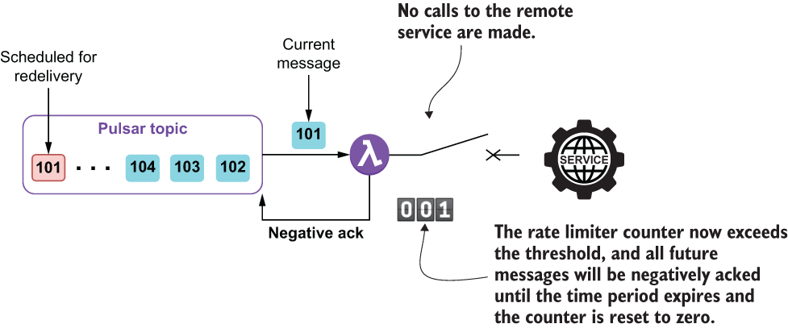

### 9.2.3 Rate limiter pattern

While the circuit breaker pattern was designed to prohibit service calls only after a preconfigured number of faults had been detected over a period of time, the rate limiter pattern, on the other hand, prohibits service calls after a preconfigured number of calls have been made within a given period, regardless of whether or not they were successful. As the name implies, the *rate limiter* pattern is used to limit the frequency at which a remote service can be called and is useful for situations where you want to restrict the number of calls made over a given period of time. One such example would be if we called a web service, such as the Google API, that restricts the number of calls you can make with a free API key to only 60 per minute.

Figure 9.10 If the rate limiter is configured to permit 100 calls per minute, then the first 100 messages would be permitted to invoke the service. The 101st message and all subsequent messages will not be permitted to call the service and, instead, will be negatively acknowledged. After one minute elapses, another 100 messages can be processed.

When using this pattern, all incoming messages result in a call to the remote service up to a preconfigured number. The rate limiter keeps track of how many calls have been made to the service, and once the limit is reached, prohibits any additional calls for the remainder of the preconfigured time window, as shown in figure 9.10. In order to utilize the rate limiter pattern inside your Pulsar function, you need to wrap the remote service call inside a decorator, as shown in listing 9.4.

Listing 9.5 Utilizing the rate limiter pattern inside a Pulsar function

import io.github.resilience4j.decorators.Decorators;\
import io.github.resilience4j.ratelimiter.\*;\
 \
...\
public class GoogleGeoEncodingService implements Function\<Address, Void\> {\
 \
  public Void process(Address addr, Context ctx) throws Exception {\
        \
   if (!initalized) {\
      init(ctx);                                                      ❶\
   }\
        \
   CheckedFunction0\<String\> decoratedFunction = \
          Decorators.ofCheckedSupplier(getFunction(addr))             ❷\
        .withRateLimiter(rateLimiter)                                 ❸\
        .decorate();\
        \
   LatLon geo = getLocation(                                          ❹\
      Try.of(decoratedFunction)                                       ❺\
          .onFailure(\
            (Throwable t) -\> ctx.getLogger().error(t.getMessage())\
       ).getOrNull());\
 \
   if (geo != null) {\
      addr.setGeo(geo);\
      ctx.newOutputMessage(ctx.getOutputTopic(),\
                           AvroSchema.of(Address.class))\
           .properties(ctx.getCurrentRecord().getProperties())\
        .value(addr)\
        .send();\
   } else {\
     // We made a valid call, but didn't get a valid geo back\
   }\
   return null;\
    }\
 \
    private void init(Context ctx) {\
    config = RateLimiterConfig.custom()\
            .limitRefreshPeriod(Duration.ofMinutes(1))                ❻\
            .limitForPeriod(60)                                       ❼\
            .timeoutDuration(Duration.ofSeconds(1))                   ❽\
            .build();\
        \
    rateLimiterRegistry = RateLimiterRegistry.of(config);\
    rateLimiter = rateLimiterRegistry.rateLimiter("name");\
    initalized = true;\
    }\
 \
      private CheckedFunction0\<String\> getFunction(Address addr) {    ❾\
         CheckedFunction0\<String\> fn = () -\> { \
          OkHttpClient client = new OkHttpClient();\
          StringBuilder sb = new StringBuilder()            \
        .append("https://maps.googleapis.com/maps/api/geocode")\
          .append("/json?address=")\
          .append(URLEncoder.encode(addr.getStreet().toString(),\
          StandardCharsets.UTF_8.toString())).append(",")\
          .append(URLEncoder.encode(addr.getCity().toString(), \
              StandardCharsets.UTF_8.toString())).append(",")\
          .append(URLEncoder.encode(addr.getState().toString(), \
              StandardCharsets.UTF_8.toString()))\
          .append("&key=").append("SIGN-UP-FOR-KEY");\
 \
       Request request = new Request.Builder()\
        .url(sb.toString())\
        .build();\
 \
      try (Response response = client.newCall(request).execute()) {\
         if (response.isSuccessful()) {\
        return response.body().string();                             ❿\
         } else {\
        String reason = getErrorStatus(response.body().string());\
          if (NON_TRANSIENT_ERRORS.stream().anyMatch(                ⓫\
                  s -\> reason.contains(s))) {\
            throw new NonTransientException();\
          } else if (TRANSIENT_ERRORS.stream().anyMatch(\
                  s -\> reason.contains(s))) {\
            throw new TransientException();\
          }\
        return null;\
         }            \
      }\
 \
     };\
     return fn;\
    }\
 \
    private LatLon getLocation(String json) {                        ⓬\
    ...\
    }\
}

❶ Initializes the rate limiter

❷ Decorates the REST call to the Google Maps API

❸ Assigns the rate limiter

❹ Parses the response from the REST call

❺ Invokes the decorated function

❻ The rate interval is one minute.

❼ Sets a limit of 60 calls per rate interval

❽ Wait one second between subsequent calls.

❾ Returns a function containing the REST API call logic

❿ If we got a valid response, return the JSON string with the latitude/longitude.

⓫ Determine the error type based on the error message.

⓬ Parses the JSON response from the Google Maps REST API call

This function calls the Google Maps API and limits the number of attempts to 60 per minute to stay in compliance with Google’s terms of use for a free account. If the number of calls exceeds this amount, then Google will block access to the API for our account as a preventative measure for a brief period of time. Therefore, we have taken proactive steps to prevent that condition from occurring.

Issues and considerations

While this is a very useful pattern to use when interacting with an external system, such as a web service or a database, be sure to consider the following factors when implementing it inside your Pulsar function:

- This pattern will almost certainly decrease the throughput for the function, so be sure to account for this throughout the entire data flow to make sure the upstream functions don’t overwhelm the rate-limited function.

- This pattern should be used to protect a remote service from getting overwhelmed with calls or to restrict the number of calls to avoid exceeding a quota which would result in you getting locked out by the third-party vendor.
