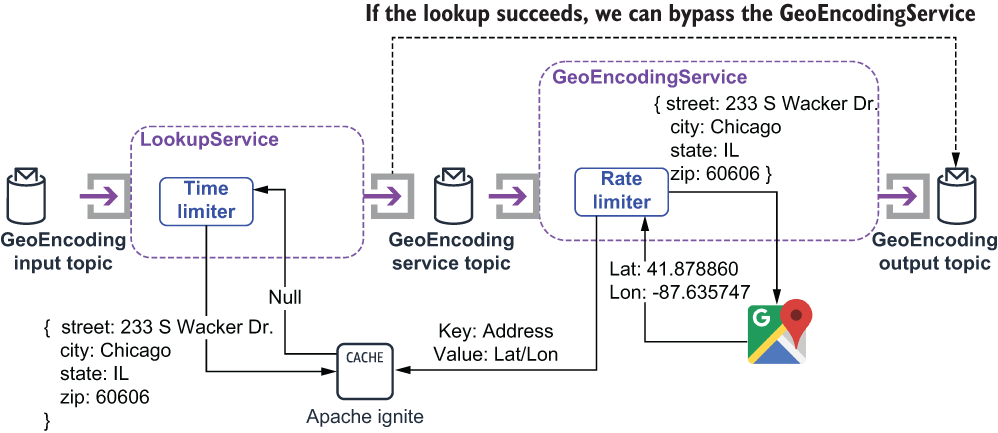

### 9.2.4 Time limiter pattern

The *time limiter* pattern is used to limit the amount of time spent calling a remote service before terminating the connection from the client side. This effectively short circuits the timeout mechanism on the remote service and allows us to determine when to give up on the remote call and terminate the connection from the client side.

This behavior is useful when you have a tight SLA on the entire data pipeline and have allocated a small amount of time for interacting with the remote service. This allows the Pulsar function to continue processing without a response from the web service rather than waiting 30 or more seconds for the connection to timeout. Doing so boosts the throughput of the function, since it no longer has to waste 30 seconds waiting on a response from a faulty service.

Consider the scenario where you first make a call to an internal caching service, such as Apache Ignite, to see if you have the data you need prior to making a call to an external service to retrieve the value. The purpose of doing so is to speed up the processing inside your function by eliminating the need for a lengthy call to a remote service. However, you run the risk of your caching service itself being unresponsive, which would result in a lengthy pause while making that call. This would defeat the entire purpose of the cache. Therefore, you decide to allocate a time budget to the cache call of 500 milliseconds to limit the impact an unresponsive cache can have on your function.

Listing 9.6 Utilizing the time limiter pattern inside a Pulsar function

import io.github.resilience4j.timelimiter.TimeLimiter;\
import io.github.resilience4j.timelimiter.TimeLimiterConfig;\
import io.github.resilience4j.timelimiter.TimeLimiterRegistry;\
 \
public class LookupService implements Function\<Address, Address\> {\
private TimeLimiter timeLimiter;\
private IgniteCache\<Address, Address\> cache;\
private String bypassTopic;\
private boolean initalized = false;\
 \
    public Address process(Address addr, Context ctx) throws Exception {\
      if (!initalized) {\
        init(ctx);                                                     ❶\
      }\
        \
      Address geoEncodedAddr = timeLimiter.executeFutureSupplier(      ❷\
        () -\> CompletableFuture.supplyAsync(() -\> \
         { return cache.get(addr); }));                                ❸\
        \
      if (geoEncodedAddr != null) {                                    ❹\
        ctx.newOutputMessage(bypassTopic, AvroSchema.of(Address.class))\
        .properties(ctx.getCurrentRecord().getProperties())\
        .value(geoEncodedAddr)\
        .send();\
      }\
      return null;\
    }\
 \
    private void init(Context ctx) {\
      bypassTopic = ctx.getUserConfigValue("bypassTopicName")\
           .get().toString();                                          ❺\
      TimeLimiterConfig config = TimeLimiterConfig.custom()\
           .cancelRunningFuture(true)                                  ❻\
        .timeoutDuration(Duration.ofMillis(500))                       ❼\
        .build();\
        \
      TimeLimiterRegistry registry = TimeLimiterRegistry.of(config);\
      timeLimiter = registry.timeLimiter("my-time-limiter");           ❽\
        \
      IgniteConfiguration cfg = new IgniteConfiguration();             ❾\
       cfg.setClientMode(true);\
       cfg.setPeerClassLoadingEnabled(true);\
 \
       TcpDiscoveryMulticastIpFinder ipFinder = \
        new TcpDiscoveryMulticastIpFinder();\
  \
        ipFinder.setAddresses(Collections.singletonList(\
        ➥ "127.0.0.1:47500..47509"));\
        \
       cfg.setDiscoverySpi(new TcpDiscoverySpi().setIpFinder(ipFinder));\
       Ignite ignite = Ignition.start(cfg);                            ❿\
       cache = ignite.getOrCreateCache("geo-encoded-addresses");       ⓫\
    }\
}

❶ Initializes the time limiter and the ignite cache

❷ Invokes the cache lookup and limits the duration of the call via the time limiter

❸ The cache lookup that is executed asynchronously

❹ If we have a cache hit, then publish the value to the different output topic.

❺ The bypass topic is configurable.

❻ Cancel running calls that exceed the time limit.

❼ Sets a time limit of 500 milliseconds

❽ Creates the time limiter based on the configuration

❾ Configures the Apache Ignite client

❿ Connects to the Apache Ignite service

⓫ Retrieves the local cache that stores geo-encoded addresses

In order to utilize the time limiter pattern inside your Pulsar function, you need to wrap the remote service call inside a CompletableFuture and execute it via the TimeLimter’s executeFutureSupplier method, as shown in listing 9.6. This lookup function assumes that the cache is populated inside the function that calls the Google Maps API. This allows us to restructure the geo-encoding process slightly to have the lookup occur before the call to the GeoEncodingService, as shown in figure 9.11.

Figure 9.11 The lookup service can be used to prevent unnecessary calls to the GeoEncodingService if we already have the latitude/longitude pair for a given address. The cache is populated with the results from the Google Maps API calls.

Again, this type of design is intended to speed up the geo-encoding process, and thus, we need to limit the amount of time we are willing to wait to get a response back from Apache Ignite before abandoning the call. If the cache lookup succeeds, then the LookupService will publish a message directly to the same GeoEncoding output topic as the GeoEncodingService does. The downstream consumer doesn’t care who published the message as long as it has the correct contents.

Issues and considerations

While this is a very useful pattern to use when interacting with an external system such as a web service or a database, be sure to consider the following factors when implementing it inside your Pulsar function:

- Adjust the time limit to match the business SLA requirements of your application. An overly aggressive time limit will cause successful calls to be abandoned too soon, resulting in unnecessary work on the remote service and missing data inside your Pulsar function.

- Do not use this pattern on operations that are idempotent; otherwise you might experience unintended side effects. It is best to only use this pattern on lookup calls and other non-state changing functions or services.
