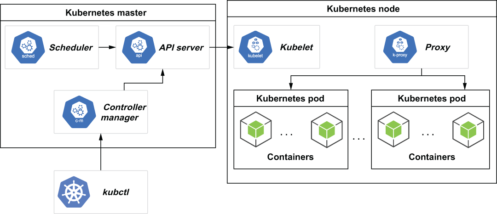

## A.1 Create a Kubernetes cluster

A cluster is the foundational base for running your containerized applications. In Kubernetes, a cluster consists of at least one *cluster master* and multiple worker machines, called *nodes*, as shown in figure A.1. The cluster master machine hosts the Kubernetes control plane, which performs all the administrative functions for the cluster, while the nodes are the machines that will host the containers themselves.

Figure A.1 The Kubernetes master node is used to control all of the Kubernetes nodes in the node pool. Each Kubernetes node can host multiple pods, which in turn can host one or more application containers.

The computing resources from all of the nodes are registered with the cluster master and form a *resource pool* from which all the containers draw. For instance, if your particular container is hosting a database application, and it requires 8 GB of RAM and four CPU cores, the cluster master would have to find a node with sufficient resources available to meet this request and run the container on it. These claimed resources would then also be subtracted from the resource pool to indicate that they are already committed to a container. Once the cluster resource pool is exhausted, no more containers can be hosted until more resources are available.

With Kubernetes, resources can be easily added by adding more nodes to the cluster. This effectively allows you to scale your cluster up based on your needs in a seamless manner. This feature is so appealing that nearly all cloud vendors offer some sort of Kubernetes option for hosting your applications. In addition, there is a large open source implementation of Kubernetes, known as OpenShift, which allows you to host a Kubernetes cluster on your own physical hardware. While both of these options are good choices for production applications, they do impose a rather high barrier for local development. Most people don’t want to pay the cost of hosting a large Kubernetes cluster simply for development or testing purposes, which is why minikube is a popular option for developers. Pulsar was designed specifically to run in a containerized environment, such as Kubernetes, where you can easily increase or decrease the number of Pulsar broker containers and/or BookKeeper bookies based on your demand.

## 子目录

- [A.1.1 Install prerequisites](<a.1-create-a-kubernetes-cluster/a.1.1-install-prerequisites.md>)
- [A.1.2 Minikube](<a.1-create-a-kubernetes-cluster/a.1.2-minikube.md>)
