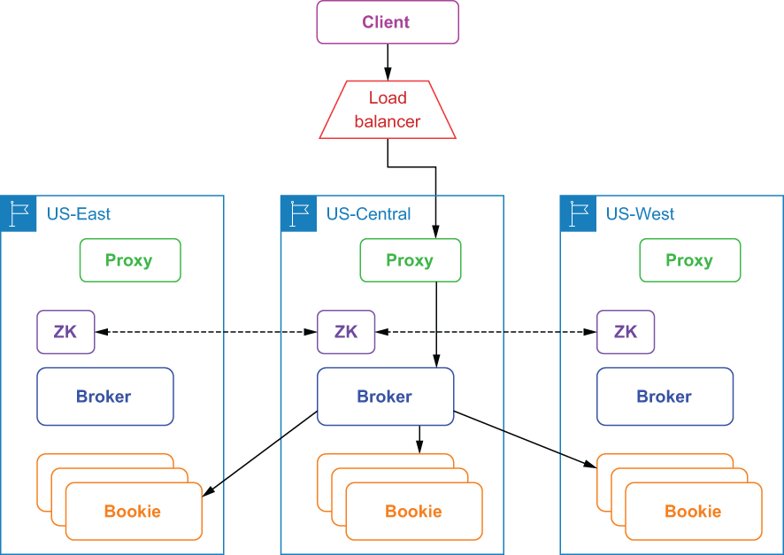

## B.1 Synchronous geo-replication

A *synchronous* geo-replicated Pulsar installation consists of a cluster of bookies running across multiple regions, a cluster of brokers also distributed across all regions, and a single global ZooKeeper installation to form a single global logical instance across all available regions, as shown in figure B.1. The global “stretched” ZooKeeper ensemble is critical to supporting this approach because it is used to store the managed ledgers.

Figure B.1 Clients access a synchronously geo-replicated cluster via a single load balancer, which forwards the publish request to one of the Pulsar proxies. The Proxy routes the request to the broker that owns the topic, which then publishes the data across the regions based on the placement policy that is configured.

In the synchronous geo-replication case, when the client issues a write request to a Pulsar cluster in one geographical location, the data is written to multiple bookies in different geographical locations within the same call. The write request is only acknowledged to the client when the configured number of the data centers have issued a confirmation that the data has been persisted. While this approach provides the highest level of data guarantees, it also incurs the cost of the cross-datacenter network latency for each message.

Synchronous geo-replication is actually achieved by Apache BookKeeper in the storage layer for Pulsar and relies on a placement policy to distribute the data across multiple data centers and to guarantee availability constraints. You can enable either the rack-aware or region-aware placement policy, depending on whether you are running in a bare metal or cloud environment, respectively, by modifying the broker configuration file (broker.conf), as shown in the following listing.

Listing B.1 Enabling the region-aware policy

\# Set this to true if your cluster is spread across racks inside one\
\# datacenter or across multiple AZs inside one region \
bookkeeperClientRackawarePolicyEnabled=true\
 \
\# Set this to true if your cluster is spread across multiple datacenters or\
\# cloud provider regions.\
bookkeeperClientRegionawarePolicyEnabled=true

When you enable the region-aware placement policy, for example, BookKeeper will choose bookies from different regions when forming a new bookie ensemble, which ensures that the topic data will be distributed evenly across all of the available regions. Note that only one of these settings will be honored at runtime with region awareness taking precedence if both are set to true.

The use of a single ZooKeeper cluster to implement synchronous geo-replication also requires some additional configuration changes in order for the geographically dispersed broker and bookie components to work together as a single cluster. Configuring ZooKeeper for such a scenario involves adding a server.N line to the conf/zookeeper.conf file for each node in the ZooKeeper cluster, where *n* is the number of the ZooKeeper nodes, as shown in the following listing, which uses one ZooKeeper node per region.

Listing B.2 Single ZooKeeper configuration for synchronous geo-replication

server.1=zk1.us-west.example.com:2888:3888\
server.2=zk1.us-central.example.com:2888:3888\
server.3=zk1.us-east.example.com:2888:3888

In addition to modifying the conf/zookeeper.conf file in the conf directory of each Pulsar installation, you will also need to modify the zkServers property in the conf/bookkeeper.conf file to list each of the ZooKeeper servers, as shown in the following listing.

Listing B.3 BookKeeper configuration for synchronous geo-replication

zkServers= zk1.us-west.example.com:2181, zk1.us-central.example.com:2181,\
zk1.us-east.example.com:2181

Similarly, you will need to update the zookeeperServers property in *both* the conf/ discovery.conf and conf/proxy.conf files to be a comma-separated list of the ZooKeeper servers as well, since both the Pulsar proxy and service discovery mechanism depend on ZooKeeper to provide them with up-to-date metadata about the Pulsar cluster.

Synchronous geo-replication provides stronger data consistency guarantees than asynchronous replication, since the data is always synchronized across the datacenters, making it easier to run your applications independent of where the messages are published. A synchronous geo-replicated Pulsar cluster can continue to function like normal even if an entire datacenter goes down, with the outage being entirely transparent to the applications that are accessing the cluster via a load balancer. This makes synchronous geo-replication good for mission-critical use cases that are able to tolerate a slightly higher publish latency.
