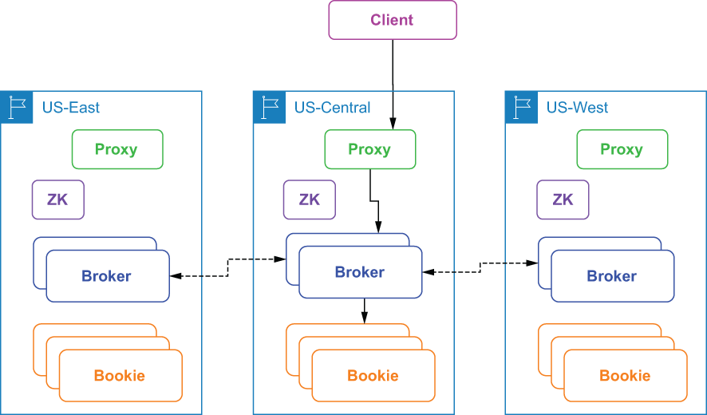

## B.2 Asynchronous geo-replication

An *asynchronous* geo-replicated Pulsar installation consists of a two or more independent Pulsar clusters running in different regions. Each Pulsar cluster contains its own respective set of brokers, bookies, and ZooKeeper nodes that are completely isolated from one another. In asynchronous geo-replication, when messages are produced on a Pulsar topic, they are first persisted to the local cluster and are then replicated asynchronously to the remote clusters. This replication process occurs via inter-broker communication, as shown in figure B.2.

Figure B.2 Clients access an asynchronously geo-replicated cluster via the closest proxy, and the proxy routes the request to the broker that owns the topic, which then publishes the data to the bookies in the same region. The broker then replicates the incoming data to the brokers in the other regions.

With asynchronous geo-replication, the message producer doesn’t wait for a confirmation from multiple Pulsar clusters. Instead, the producer receives a response immediately after the nearest cluster successfully persists the data. The data is then replicated to the other Pulsar clusters in an asynchronous fashion in the background. Under normal conditions, messages are replicated at the same time that they are dispatched to local consumers.

While asynchronous geo-replication provides lower latency because the client doesn’t have to wait for responses from the other data centers, it also provides weaker consistency guarantees due to asynchronous replication. Given that there is always a replication lag in asynchronous replication, there will always be some amount of data that hasn’t been replicated from source to destination at any given point in time. Therefore, if you choose to implement this pattern, your application must be able to tolerate some data loss in exchange for lower publish latency. Typically, the end-to-end replication latency is bounded by the *network round-trip time* (RTT) between the remote regions.

It is worth noting that asynchronous geo-replication is enabled on a per-tenant basis in Pulsar rather than a cluster-wide basis, allowing you to configure replication only for those topics for which it is needed. This allows each individual department or group to maintain control over its data replication policies. Asynchronous geo-replication is managed at the namespace level, which provides more granular control over the datasets that get replicated. This is particularly useful for cases in which you are not permitted to allow data to leave a particular region due to regulatory and/or security reasons.

## 子目录

- [B.2.1 Configuring asynchronous geo-replication](<b.2-asynchronous-geo-replication/b.2.1-configuring-asynchronous-geo-replication.md>)
