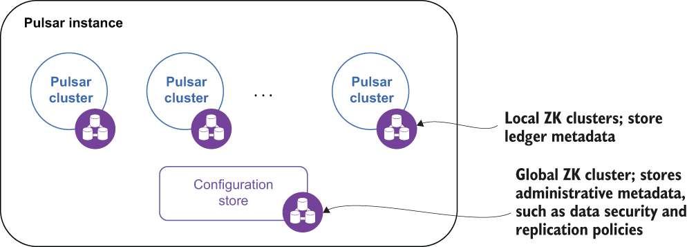

### B.2.1 Configuring asynchronous geo-replication

As you may recall from chapter 2, a Pulsar instance is comprised of one or more Pulsar clusters that act together as a single unit and can be administered from a single location, as shown in figure B.3. In fact, one of the biggest reasons for using a Pulsar instance is to enable geo-replication, and only clusters within the same instance can be configured to replicate data amongst themselves. Therefore, enabling asynchronous geo-replication requires us to first create a Pulsar instance.

Figure B.3 A Pulsar instance can consist of multiple, geographically dispersed clusters.

A Pulsar instance employs an instance-wide ZooKeeper cluster called the *configuration store* to retain information that pertains to multiple clusters, such as geo-replication and tenant-level security policies. This allows you to define and manage these policies in a single location. While the complete documentation is available online, I wanted to highlight a few of these steps in the next section.

It is worth noting that the instance-wide ZooKeeper instance should be deployed in such a manner as to make it completely independent from the individual Pulsar clusters so that, in the event of a failure on the part of the instance-wide ZooKeeper ensemble, the individual clusters will be able to continue to function without interruption.

Deploying the configuration store

In addition to installing the individual clusters, creating a multi-cluster Pulsar instance involves deploying a separate ZooKeeper quorum to use as the configuration store. This configuration store should be implemented with its own dedicated ZooKeeper quorum spread across at least three regions. Given the very low expected load on the configuration store servers, you can share the same hosts used for the local ZooKeeper quorum, but will have to do so as either separate ZooKeeper processes or K8s pods, depending on your deployment environment. You will also have to use a different TCP port to avoid port conflicts.

Listing B.4 ZooKeeper configuration for the configuration store quorum

tickTime=2000\
dataDir=/var/lib/zookeeper                       ❶\
clientPort=2185                                  ❷\
initLimit=5\
syncLimit=2\
server.1=zk2.us-west.example.com:2185:2186       ❸\
server.2=zk2.us-central.example.com:2185:2186\
server.3=zk2.us-east.example.com:2185:2186

❶ Use a different location for storing the transaction log.

❷ Use a different port than the local ZK instance.

❸ The quorum consists of servers from across three regions listening on the same port.

Setting up a separate ZooKeeper quorum is fairly straightforward and well documented on the Apache ZooKeeper documentation page. Each ZooKeeper server is contained in a single JAR file, so installation consists of downloading the jar, unpacking it, and creating a configuration file. The default location for this configuration file is conf/zoo.cfg. All of the servers in the new ZooKeeper quorum should have the exact same configuration file, as shown in listing B.4.

Initializing cluster metadata

Now that the secondary ZooKeeper quorum is up and running, the next step is to populate the configuration store with information about all the clusters that will be included in the Pulsar instance. This metadata can be initialized by using the initialize- cluster-metadata command of the Pulsar CLI tool, as shown in the following listing.

Listing B.5 Initializing the cluster metadata

\$ /pulsar/bin/pulsar initialize-cluster-metadata \\\
  --cluster us-west \\                                             ❶\
  --zookeeper zk1.us-west.example.com:2181 \\                      ❷\
  --configuration-store zk1.us-west.example.com:2184 \\            ❸\
  --web-service-url http://pulsar.us-west.example.com:8080/ \\   \
  --web-service-url-tls https://pulsar.us-west.example.com:8443/ \\   \
  --broker-service-url pulsar://pulsar.us-west.example.com:6650/ \\  \
  --broker-service-url-tls pulsar+ssl://pulsar.us-west.example.com:6651/

❶ The name of the cluster that will be used when setting up replication

❷ The local ZK connection string

❸ The connection string for the configuration store

The command associates all the various connection URLs to a given cluster name and stores that information inside the configuration store. This information is used when replication is enabled to connect the brokers that need to exchange data between them (e.g., replication data from US-West to US-East). You will need to run this command for every Pulsar cluster you are adding to the instance.

Configure the services to use the configuration store

After you have populated the configuration store with all the metadata associated with the Pulsar clusters in your instance, you will need to modify a couple of configuration files on *every* cluster to enable geo-replication. Since geo-replication is accomplished via broker-to-broker communication, the most important one is the conf/broker.conf configuration file, as shown in the following listing.

Listing B.6 Updated broker.conf for asynchronous geo-replication

\# Local ZooKeeper servers\
zookeeperServers=zk1.us-west.example.com:2181,zk2.us-\
➥ west.example.com:2181,zk3.us-west.example.com:2181          ❶\
 \
\# Configuration store quorum connection string.\
configurationStoreServers=zk2.us-west.example.com:2185,zk2.us-\
➥ central.example.com:2185,zk2.us-east.example.com:2185       ❷\
 \
clusterName=us-west                                            ❸

❶ Use the local ZK quorum as before.

❷ Use the second ZK quorum for the configuration store.

❸ Specify the name of the cluster that the broker belongs to.

Make sure that you set the zookeeperServers parameter to reflect the local quorum and the configurationStoreServers parameter to reflect the configuration store quorum. You also need to specify the name of the cluster to which the broker belongs using the clusterName parameter, taking care to use the value you specified in the initialize-cluster-metadata command. Finally, make sure that the broker and web service ports match the values you provided in the initialize-cluster-metadata command as well. Otherwise, the replication process will fail because the source broker will be attempting communication over the wrong port.

If you are using the service discovery mechanism included with Pulsar, you need to change a few parameters in the conf/discovery.conf configuration file. Specifically, you must set the zookeeperServers parameter to the ZooKeeper quorum connection string of the cluster and the configurationStoreServers setting to the configuration store quorum connection string using the same values used in the broker configuration file. Once you have finished updating all of the necessary configuration files, all of these services will need to be restarted after these changes are made for the new properties to take effect.
