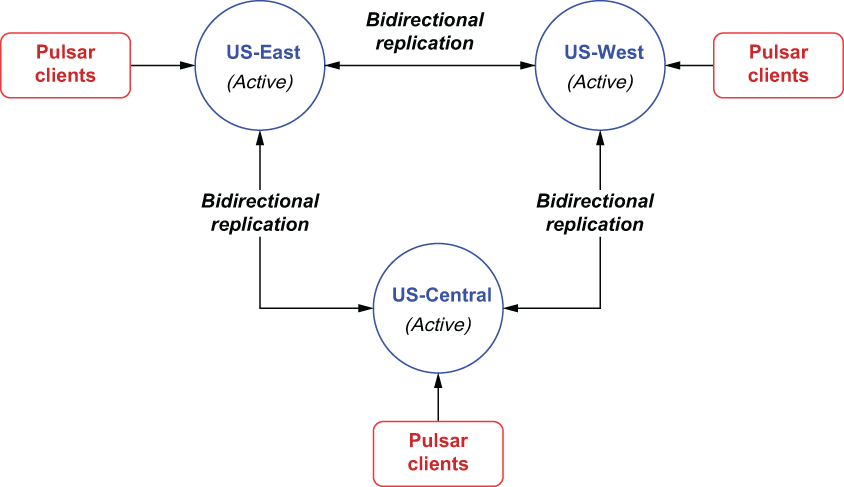

### B.3.1 Multi-active geo-replication

Asynchronous geo-replication is controlled on a per-tenant basis in Pulsar. This means geo-replication can only be enabled between clusters when a tenant has been created that allows access to all of the clusters involved. To configure *multi-active geo-replication*, you need to specify which clusters a tenant has access to via the pulsar-admin CLI, as shown in the following listing, which displays the command to create a new tenant and grant it permission to access the US-East and US-West clusters only.

Listing B.7 Granting a tenant access to clusters

\$ /pulsar/bin/pulsar-admin tenants create customers \\   ❶\
  --allowed-clusters us-west,us-east \\                  ❷\
  --admin-roles test-admin-role

❶ Create a new tenant named customers.

❷ Grant the tenant permission to access these two clusters only.

Now that the tenant has been created, we need to configure the geo-replication at the namespace level. Therefore, we will first need to create the namespace using the pulsar-admin CLI tool and then assign the namespace to a cluster—or multiple clusters—using the set-clusters command, as shown in the following listing.

Listing B.8 Assigning a namespace to a cluster

\$ /pulsar/bin/pulsar-admin namespaces create customers/orders\
 \
\$ /pulsar/bin/pulsar-admin namespaces set-clusters customers/orders \\\
  --clusters us-west,us-east,us-central

By default, once replication is configured between two or more clusters, as shown in listing B.8, all of the messages published to topics inside the namespace in one cluster are asynchronously replicated to all the other clusters in the list. Therefore, the default behavior is effectively full-mesh replication of all the topics in the namespace with messages getting published in multiple directions, as shown in figure B.4. When you only have two clusters, the default behavior can be thought of as an active-active cluster configuration where the data is available on both clusters to serve clients, and in the event of a single cluster failure, all of the clients can be redirected to the remaining active cluster without interruption.

Figure B.4 The default behavior is full-mesh geo-replication between all clusters. Messages published to a topic inside a replicated namespace in the US-East cluster will be forwarded to both the US-West and US-Central clusters.

Besides full-mesh (active-active) geo-replication, there are a few other replication patterns you can use. Another common one for disaster recovery is the *active-standby replication* *pattern.*
