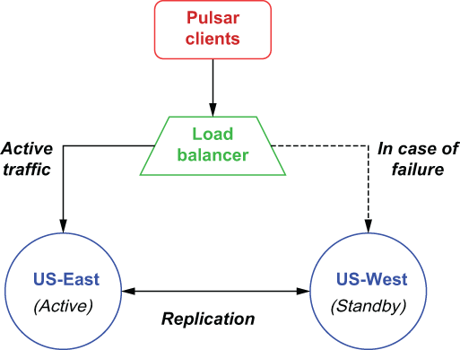

### B.3.2 Active-standby geo-replication

In this situation you are looking to keep an up-to-date copy of the cluster at a different geographical location, so you can resume operations in the event of a failure with a minimal amount of data loss or recovery time. Since Pulsar doesn’t provide a means for specifying one-way replication of namespaces, the only way to accomplish this configuration is by restricting the clients to a single cluster, known as the active cluster, and having them all failover to the standby cluster only in the event of a failure. Typically, this can be accomplished via a load balancer or other network-level mechanism that makes the transition transparent to the clients, as shown in figure B.5. Pulsar clients publish messages to the active cluster, which are then replicated to the standby cluster for backup.

Figure B.5 You can use asynchronous geo-replication to implement an active-standby scenario in which all of the data within a given namespace is forwarded to a cluster that will be used only in the event of a failure.

As you may have noticed, the replication of the Pulsar data will still be done bi-directionally, which means that the US-West cluster will attempt to send the data it receives during the outage to the US-East cluster. This might be problematic if the failure is related to one or more components within the Pulsar cluster or the network for the US-East cluster is unreachable. Therefore, you should consider adding selective replication code inside your Pulsar producers to prevent the US-West cluster from attempting to replicate messages to the US-East cluster, which is most likely dead.

You can restrict replication selectively by directly specifying a replication list for a message at the application level. The code in listing B.9 shows an example of producing a message that will only be replicated to the US-West cluster, which is the behavior you want in this active-standby scenario.

Listing B.9 Selective replication per message

List\<String\> restrictDatacenters = Lists.newArrayList("us-west");\
 \
Message message = MessageBuilder.create()\
    ...\
    .setReplicationClusters(restrictDatacenters)\
    .build();\
 \
producer.send(message);

Sometimes you want to funnel messages from multiple clusters into a single location for aggregation purposes. One such example would be gathering all the payment data collected from across all the geographical regions for processing and collection.
