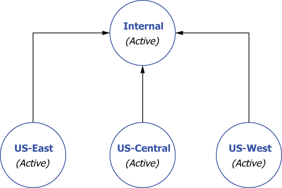

### B.3.3 Aggregation geo-replication

Assume we have three clusters all actively serving the GottaEat customers in their respective regions and a fourth Pulsar cluster named *internal* that is completely isolated from the web and only accessible by internal employees, and that is used to aggregate the data from all of the customer-serving Pulsar clusters, as shown in figure B.6. To implement aggregation geo-replication across these four clusters, you will need to use the commands shown in listing B.10, which first creates the E-payments tenant and grants access to all the clusters.

Figure B.6 An aggregation geo-replication configuration to funnel messages from three customer-facing Pulsar clusters to an internal Pulsar cluster for aggregation and analysis

Next, you will need to create a namespace for each of the customer services clusters (e.g., E-payments/us-east-payments). You *cannot* use one such as E-payments/ payments because that would lead to full mesh replication if you attempted to use it, since every cluster would have that namespace. Thus, a per-cluster namespace is required for this to work.

Listing B.10 Aggregator geo-replication

/pulsar/bin/pulsar-admin tenants create E-payments \\                    ❶\
--allowed-clusters us-west,us-east,us-central,internal\
 \
/pulsar/bin/pulsar-admin namespaces create E-payments/us-east-payments   ❷\
/pulsar/bin/pulsar-admin namespaces create E-payments/us-west-payments\
/pulsar/bin/pulsar-admin namespaces create E-payments/us-central-payments\
 \
/pulsar/bin/pulsar-admin namespaces set-clusters \\                      ❸\
E-payments/us-east-payments --clusters us-east,internal\
 \
/pulsar/bin/pulsar-admin namespaces set-clusters \\                      ❹\
E-payments/us-west-payments --clusters us-west,internal\
 \
/pulsar/bin/pulsar-admin namespaces set-clusters \\                      ❺\
E-payments/us-central-payments --clusters us-central,internal

❶ Create the global tenant for Payments.

❷ Create the cluster-specific namespaces.

❸ Configure US-East to internal replication.

❹ Configure US-West to internal replication.

❺ Configure US-Central to internal replication.

If you decide to implement this pattern and you intend to run identical copies of an application across all the customer-servicing cluster, be sure to make the topic name configurable so the application running on US-East knows to publish messages to topics inside the us-east-payments namespace. Otherwise, the replication will not work.
