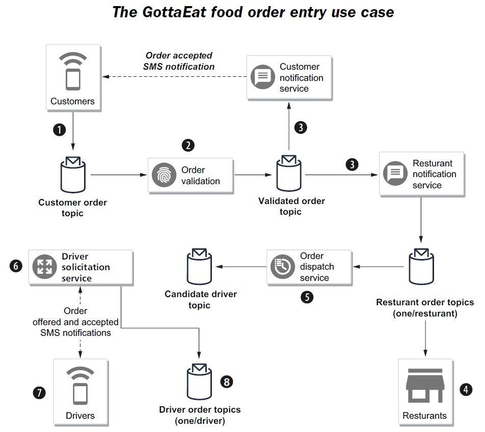

# inside back cover

1.  Customers submit their orders using the company website or mobile application.

2.  An order validation service subscribes to the customer order topic and validates the order, including taking the provided payment information.

3.  Orders that are validated get published to the validated order topic and are consumed by both the customer notification service (e.g., sends an SMS message to the customer, confirming the order was placed on the mobile app) and the restaurant notification service that publishes the order into the individual restaurant order topic.

4.  The restaurants review the incoming orders from their topic, update the status of the order from “new” to “accepted” and provide a pickup time window of when they feel the food will be ready.

5.  The order dispatcher service is responsible for assigning the accepted orders to drivers.

6.  The driver solicitation service pushes a notification to each of the drivers in the list, offering them the order. When one of the drivers accepts the order, a notification is sent back to the solicitation service.
